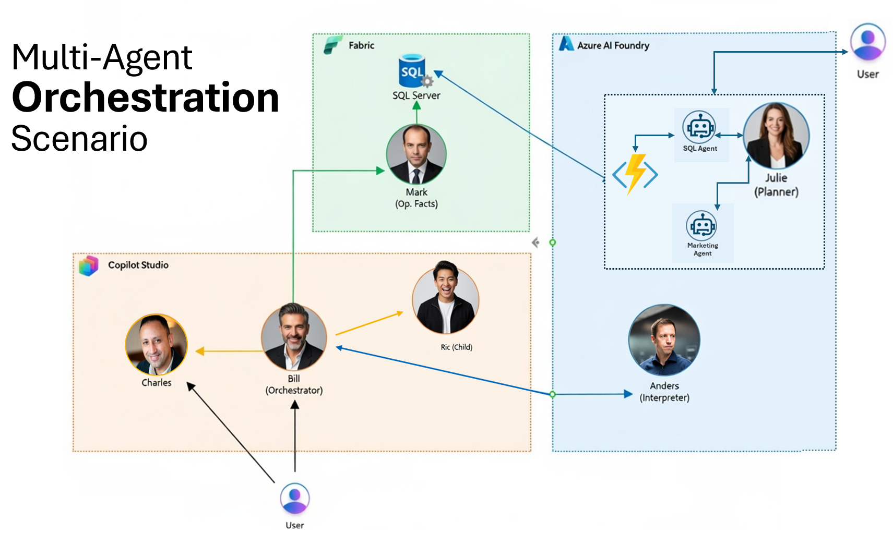

## <a id="descripcion-general"></a>Descripción general

Este workshop práctico guía a los participantes en el diseño e implementación de una arquitectura **multi-agente** usando servicios de Microsoft, aplicada a un escenario de negocio tipo **Contoso Retail**. El foco del ejercicio no es construir un sistema productivo, sino entender cómo **orquestar agentes con responsabilidades claras** para resolver distintos tipos de preguntas de negocio sobre un mismo conjunto de datos.

La arquitectura integra tres capas bien definidas:

- **Microsoft Fabric**, como fuente de datos: aloja la base SQL de retail y un Data Agent que responde preguntas en lenguaje natural.
- **Azure AI Foundry**, como capa de razonamiento y ejecución: agentes que generan reportes HTML vía OpenAPI y planifican campañas de marketing consultando la base de datos.
- **Copilot Studio**, como capa de orquestación y experiencia conversacional: un agente orquestador que conecta todos los agentes, un agente de producto con conocimiento en SharePoint y un agente hijo que envía correos electrónicos.

Copilot Studio actúa como el único punto de entrada y salida para el usuario, coordinando el trabajo de los agentes de datos y de razonamiento para entregar una única respuesta coherente. El agente se publica en Microsoft 365 y Teams para su consumo.

------

## <a id="escenario"></a>Escenario de negocio: Contoso Retail

Contoso es una empresa de retail que vende productos a clientes empresariales y finales. Su modelo de datos incluye información de clientes, cuentas, órdenes, líneas de orden, facturas, pagos, productos y categorías.

Sobre esta base, el negocio necesita responder dos tipos de preguntas frecuentes:

1. **Preguntas operativas**, orientadas a entender qué ocurrió en un caso puntual.
2. **Preguntas analíticas**, orientadas a entender patrones, tendencias y señales del negocio.

El workshop muestra cómo una misma arquitectura puede atender ambos tipos de necesidades sin duplicar sistemas ni lógica.

------

## <a id="flujos"></a>Flujos de negocio cubiertos

### <a id="flujo-operativo"></a>Flujo operativo

El flujo operativo responde a solicitudes concretas sobre clientes, órdenes y facturación. En este flujo, el objetivo es reconstruir los hechos transaccionales con precisión y producir artefactos visuales (reportes HTML) que sinteticen la información.

El pipeline implementado funciona así:

1. El usuario pide información operativa (p. ej. un reporte de órdenes de un cliente).
2. **Bill** (orquestador) delega a **Mark** (Fabric) para obtener los hechos transaccionales exactos: órdenes, líneas de orden, montos, fechas, etc.
3. **Bill** delega a **Anders** (Foundry) para generar un reporte visual a partir de esos datos. Anders invoca la Azure Function `OrdersReporter` vía su herramienta OpenAPI, la cual construye un reporte HTML y lo sube a Blob Storage.
4. Anders retorna la URL del reporte publicado y Bill consolida la respuesta al usuario.

Ejemplos de preguntas operativas:

- Genera un reporte de las órdenes de Izabella Celma.
- ¿Cuáles son las órdenes y productos de Marco Rivera?
- Necesito un resumen visual de las compras recientes de un cliente.

### <a id="flujo-analitico"></a>Flujo analítico y de planificación

El flujo analítico responde a preguntas de carácter estratégico y exploratorio. Aquí el objetivo no es explicar un caso puntual, sino identificar señales relevantes que ayuden a priorizar acciones y generar planes concretos.

En este flujo, **Julie** (Foundry) actúa como agente planificador de campañas de marketing. Julie orquesta dos sub-agentes internos: `SqlAgent` (que ejecuta consultas SQL contra la base de datos de Fabric vía la Azure Function `SqlExecutor`) para segmentar clientes, y `MarketingAgent` que genera el plan de campaña en formato JSON.

Ejemplos de preguntas analíticas y de planificación:

- Crea una campaña para clientes que hayan comprado bicicletas.
- ¿Qué segmentos de clientes deberían recibir ofertas especiales?
- Planifica una campaña de retención para clientes inactivos.

------

## <a id="arquitectura"></a>Arquitectura y agentes



### <a id="capa-datos"></a>Microsoft Fabric – Capa de datos

- **Mark (Data Agent)**
  Data Agent de Fabric que interpreta lenguaje natural y consulta el modelo semántico construido sobre la base SQL `db_retail` (tablas `customer`, `orders`, `orderline`, `product`). Reconstruye hechos transaccionales exactos y los entrega como datos trazables, sin interpretación.

#### Documentación de la base de datos

Para comprender mejor el modelo de datos sobre el cual operan los agentes de Fabric, se ha agregado documentación detallada de la base de datos de Contoso Retail. Esta documentación incluye:

- **Diagrama ER (Entidad-Relación)** que muestra las relaciones entre las tablas principales
- **Esquemas de tablas** con todos los campos y tipos de datos

Puedes consultar la documentación completa aquí: [Database Documentation](./assets/database.md)

### <a id="capa-razonamiento"></a>Azure AI Foundry – Capa de razonamiento

- **Anders (Executor Agent)**
  Ejecuta acciones operativas invocando servicios externos mediante una herramienta OpenAPI. Recibe datos de órdenes y llama al endpoint `OrdersReporter` de la Azure Function `FxContosoRetail`, que genera un reporte HTML y lo publica en Blob Storage, retornando la URL del documento. Usa el SDK `Azure.AI.Agents.Persistent` con un modelo GPT-4.1 para interpretar la solicitud, construir el payload JSON y orquestar la llamada a la API.
- **Julie (Planner Agent)**
  Se implementa como workflow agent, orquesta `SqlAgent` y `MarketingAgent`, y obtiene segmentos de clientes ejecutando SQL vía OpenAPI (`SqlExecutor` de la Azure Function `FxContosoRetail`) encapsulada en `SqlAgent`.

### <a id="capa-orquestacion"></a>Copilot Studio – Capa de orquestación

- **Charles (Product Q&A Agent)**
  Agente analista de producto que responde preguntas usando documentación almacenada en SharePoint como fuente de conocimiento. También realiza análisis competitivo y comparaciones de mercado usando información pública cuando el usuario lo solicita.
- **Bill (Orchestrator)**
  Orquestador central. Detecta la intención del usuario y delega al agente correcto: conecta agentes externos de Fabric (Mark) y Foundry (Anders) y agentes internos de Copilot Studio (Charles, Ric). Se publica en Microsoft 365 y Teams.
- **Ric (Child Agent)**
  Agente hijo de Bill responsable de enviar correos electrónicos al usuario con la información solicitada (p. ej., resultados de consultas o reportes).

------

## <a id="objetivo"></a>Objetivo del workshop

Al finalizar el workshop, los participantes comprenderán:

- Cómo separar datos, razonamiento y experiencia de usuario.
- Cómo diseñar agentes con responsabilidades bien delimitadas.
- Cómo orquestar flujos operativos y analíticos sobre un mismo dominio de negocio.
- Cómo usar Copilot Studio como capa central de control en soluciones multi-agente.

Este repositorio sirve como guía práctica y reutilizable para entender y replicar este patrón arquitectónico en escenarios reales.

## <a id="laboratorios"></a>Tabla de contenidos del workshop

El workshop está dividido en laboratorios independientes pero conectados, organizados por capa arquitectónica. Se recomienda seguirlos en el orden indicado.

### 1. Laboratorios de Microsoft Fabric

- [Lab 1 – Setup del ambiente: capacidad de Fabric, workspace, base SQL y modelo semántico](./labs/fabric/lab01-data-setup.md)
- [Lab 2 – Agente Mark: Data Agent sobre el modelo semántico de retail](./labs/fabric/lab02-mark-facts-agent.md)

### 2. Laboratorios de Azure AI Foundry

- [Setup de infraestructura de Foundry](./labs/foundry/setup.md)
- [Lab 3 – Agente Anders: soporte OpenAPI, despliegue de Function App y ejecución del agente executor](./labs/foundry/lab03-anders-executor-agent.md)
- [Lab 4 – Agente Julie: workflow agent con sub-agentes SqlAgent y MarketingAgent](./labs/foundry/lab04-julie-planner-agent.md)

### 3. Laboratorios de Copilot Studio

- [Lab 5 – Setup de Copilot Studio: entorno, solución y publisher](./labs/copilot/lab05-mcs-setup.md)
- [Lab 6 – Agente Charles: Q&A de producto con SharePoint y análisis de mercado](./labs/copilot/lab06-charles-copilot-agent.md)
- [Lab 7 – Agente Ric: agente hijo para envío de correos + configuración inicial de Bill](./labs/copilot/lab07-ric-child-agent.md)
- [Lab 8 – Orquestador Bill: conexión de agentes externos (Mark, Anders) e internos (Charles) y reglas de orquestación](./labs/copilot/lab08-bill-orchestrator.md)
- [Lab 9 – Publicación de Bill en Microsoft 365 / Teams y pruebas end-to-end](./labs/copilot/lab09-bill-publishing.md)

---

## <a id="resultado"></a>Resultado esperado

Al finalizar el workshop, los participantes habrán construido y comprendido:

- Cómo diseñar agentes con responsabilidades claras.
- Cómo separar datos, razonamiento y experiencia de usuario.
- Cómo orquestar múltiples agentes desde Copilot Studio.
- Cómo reutilizar el mismo patrón arquitectónico para distintos escenarios de negocio.

Este repositorio sirve como guía práctica y reutilizable para diseñar soluciones multi‑agente en proyectos reales.

---

## <a id="requisitos"></a>Requisitos previos

### <a id="conocimientos"></a>Conocimientos

- Conocimientos básicos de Azure.
- Familiaridad general con conceptos de datos y analítica.
- No se requiere experiencia previa profunda en Fabric, Foundry o Copilot Studio.

### <a id="requisitos-tecnicos"></a>Requisitos técnicos (instalar antes del workshop)

Cada participante debe tener las siguientes herramientas instaladas en su máquina **antes de llegar al workshop**:

| Herramienta | Descripción | Descarga |
|-------------|-------------|----------|
| **.NET 8 SDK** | Compilar y ejecutar las Azure Functions y los agentes de Foundry | [Descargar](https://dotnet.microsoft.com/download/dotnet/8.0) |
| **Azure CLI** | Autenticarse en Azure, desplegar recursos y asignar roles RBAC | [Instalar](https://learn.microsoft.com/cli/azure/install-azure-cli) |
| **Azure Functions Core Tools v4** | Publicar Azure Functions a Azure | [Instalar](https://learn.microsoft.com/azure/azure-functions/functions-run-local#install-the-azure-functions-core-tools) |
| **PowerShell** | Ejecutar scripts de despliegue de infraestructura | Windows: incluido · macOS/Linux: [Instalar PowerShell 7+](https://learn.microsoft.com/powershell/scripting/install/installing-powershell) |
| **Git** | Clonar el repositorio del taller | [Descargar](https://git-scm.com/downloads) |
| **VS Code** (recomendado) | Editor de código con extensiones para Azure y .NET | [Descargar](https://code.visualstudio.com/) |

> [!TIP]
> En **macOS**, puedes instalar todas las herramientas con Homebrew:
> ```bash
> brew install dotnet-sdk azure-cli azure-functions-core-tools@4 powershell git
> brew install --cask visual-studio-code
> ```

> [!TIP]
> En **Windows**, puedes instalar todas las herramientas con winget:
> ```powershell
> winget install Microsoft.DotNet.SDK.8 Microsoft.AzureCLI Microsoft.Azure.FunctionsCoreTools Git.Git Microsoft.VisualStudioCode
> ```

### Verificar la instalación

Después de instalar, verifica que todo esté disponible ejecutando estos comandos en una terminal:

```powershell
dotnet --version        # Debe mostrar 8.x.x
az --version            # Debe mostrar azure-cli 2.x.x
func --version          # Debe mostrar 4.x.x
pwsh --version          # Debe mostrar PowerShell 7.x.x (macOS/Linux)
git --version           # Debe mostrar git version 2.x.x
```

### Recursos Azure

- Una **suscripción de Azure** activa con permisos de **Owner** o **Contributor**
- El **nombre del tenant temporal** asignado para el workshop (se proporcionará el día del evento)

---

## <a id="notas"></a>Notas finales

Este workshop está pensado como un ejercicio **pedagógico y arquitectónico**. El foco está en el diseño del flujo y la colaboración entre agentes, no en optimizar modelos ni consultas al extremo.
