# **Microsoft Copilot Studio - Configuración**
## 🎯Resumen de la misión
En este laboratorio guiado y práctico, aprenderás a establecer tu entorno base para Copilot Studio creando y configurando un espacio de trabajo llamado “MultiAgentWrkshp”. También crearás una solución que servirá como el centro para todos tus agentes y componentes de Copilot Studio, asegurando que tu proceso de desarrollo sea organizado y eficiente. Al seguir las instrucciones paso a paso, obtendrás experiencia práctica para configurar, administrar y personalizar tu entorno y así agilizar futuros proyectos de Copilot Studio. 
## 🔎 Objetivos
Al completar este laboratorio, producirás lo siguiente: 
- Crea tu entorno de trabajo “**MultiAgentWrkshp**” para Copilot Studio 
- Crea una solución donde se contengan todos tus agentes y componentes de Copilot Studio. 
- Establece tu solución como la solución predeterminada, para que los componentes nuevos se almacenen en ella de forma predeterminada 
**Ahora, pasemos a los pasos del laboratorio:** 
- Crea tu entorno 
- En este laboratorio crearás un entorno de Power Platform donde vivirán todos tus agentes de Microsoft Copilot Studio.
  
 1- Ve a la consola de administración de Power Platform http://aka.ms/ppac y selecciona la opción “Manage” en la barra lateral izquierda
 
 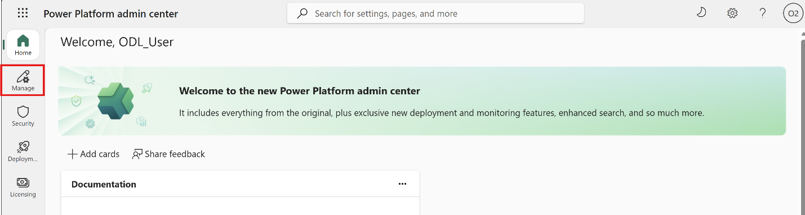
 
 2- Haz clic en la opción Environments:
 
 
 
 3- Selecciona “New” para crear un nuevo entorno:
 
 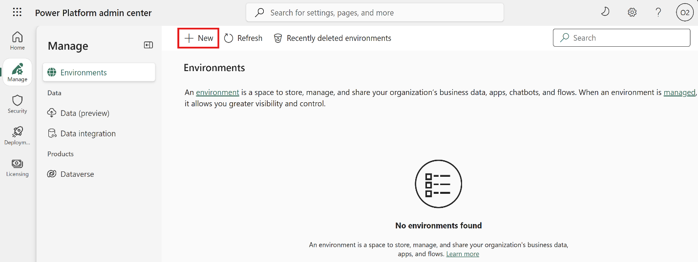

 4- El panel de detalles de New Environment aparece en el lado derecho de la pantalla.
 
 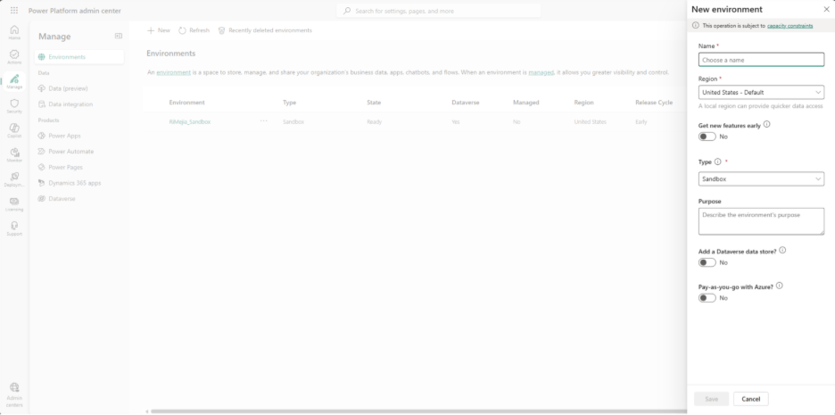

En el panel de detalles de New Environment, ingresa lo siguiente: 
- Nombre: **MultiAgentWrkshp** 
- Región:** asegúrate de que esté seleccionado “United States - Default”** 
- Tipo: **Sandbox** 
- Propósito:** este es el entorno para ejecutar los laboratorios del taller Multi-Agent** 
- Agregar un almacén de datos de Dataverse? : **activa el interruptor (Toggle) en ON**
- El panel de detalles de tu nuevo entorno debería verse así:
 
    

- Haz clic en “Next” para ingresar configuraciones adicionales para tu entorno de Microsoft Copilot Studio.

    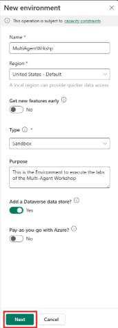

En el panel Next, sigue los pasos de la tabla a continuación: 

| Haz clic en “+ Select” debajo de “Security Group *” | Selecciona la opción “All Company” en la sección “Restricted Access” | Tus detalles adicionales del nuevo entorno deberían verse así |
| --- | --- | --- |
|  | 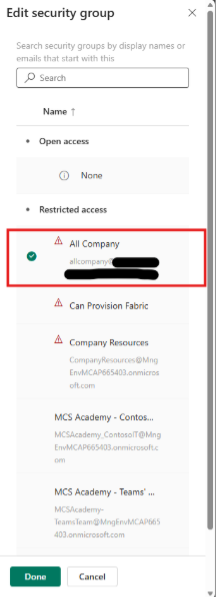 |  |

Haz clic en “Save” para crear tu entorno de Microsoft Copilot Studio.

Deberías ver una pantalla como la siguiente, que indica que tu entorno se está preparando: 

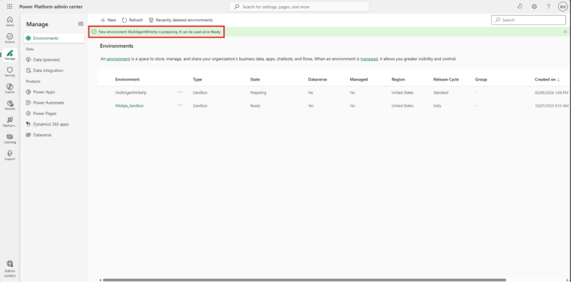

Una vez aprovisionado por completo y listo, obtendrás una confirmación como la imagen de abajo. Usa el botón “Refresh” disponible para actualizar el estado de creación del entorno. 

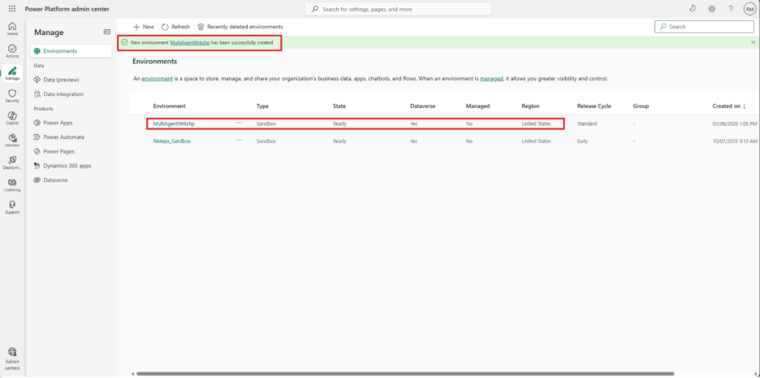

Verifica que las propiedades de tu entorno recién creado estén correctas. Principalmente: Name, Type, State=Ready y Dataverse=YES. 

# Crea una solución para almacenar todos tus componentes de trabajo

En este laboratorio, aprenderás a armar una solución (Solution), el vehículo oficial de implementación para tus agentes de Microsoft Copilot Studio.
Piensa en esto como crear un maletín digital que contiene tu agente y sus artefactos/componentes. 
Cada agente necesita un hogar bien estructurado. Eso es lo que proporciona una solución de Power Platform: orden, portabilidad y preparación para producción.  

Manos a la obra. 
1. Ve a Copilot Studio. Asegúrate de estar en el entorno correcto (Environment) = **MultiAgentWrkshp**

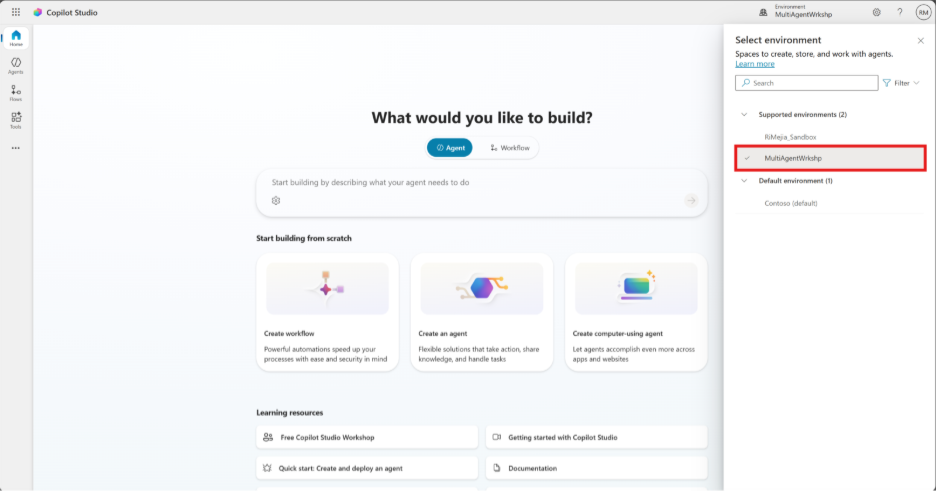

2. Haz clic en “…” en el menú de la barra izquierda. 

3. Selecciona **Solutions**
   

4. Esto abrirá una nueva pestaña en tu navegador.
5. Ahora Vamos a crear una <u>Solution</u>. Se cargará el **Solution Explorer** en Copilot Studio. Selecciona **+ New solution**
   
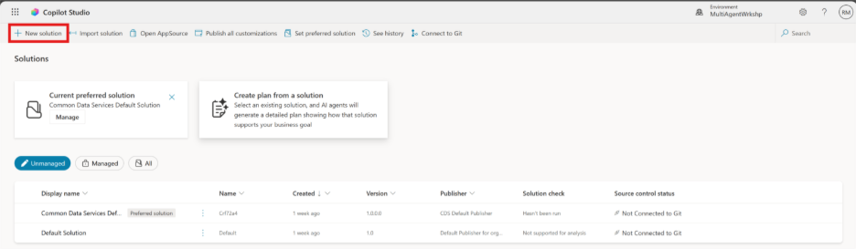

6. Aparecerá el panel New solution, donde podremos definir los detalles de nuestra solución.
   

7. Primero, necesitamos crear un nuevo publisher. Selecciona **+ New publisher**. Aparecerá la pestaña Properties del panel New publisher, con campos obligatorios y no obligatorios para completar en la pestaña Properties. Aquí podemos detallar la información del publisher, que se usará como la etiqueta o marca que identifica quién creó o es dueño de la solución.

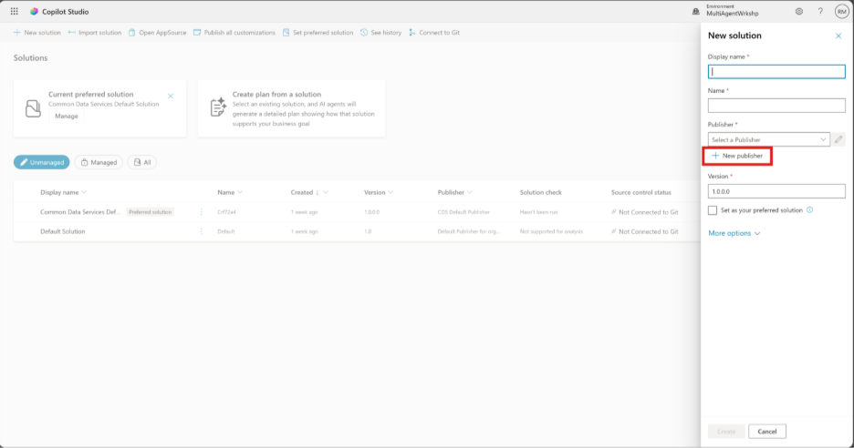

| Propiedad | Descripción | Obligatorio |
| --- | --- | --- |
| Nombre para mostrar | Nombre para mostrar del publisher | Sí |
| Nombre | El nombre único y el nombre del esquema para el publisher | Sí |
| Descripción | Describe el propósito de la solución | No |
| Prefijo | Prefijo del publisher que se aplicará a los componentes recién creados | Sí |
| Prefijo del valor de opción | Genera un número basado en el prefijo del publisher. Este número se usa cuando agregas opciones a opciones (choices) y da un indicador de qué solución se usó para agregar la opción. | Sí |

Copia y pega lo siguiente 
- Como **Display name**:  **My Multi Agent Publisher** 
- Como **Name**: **MyMultiAgentPublr** 
- Como **Description**: **This is the publisher for my Multi Agent Workshop Solution**  
- Para el **Prefix**: **mmap** 
- De forma predeterminada, el **Choice value** prefix mostrará un valor entero. Actualiza este valor entero al millar más cercano. Por ejemplo, en mi captura de pantalla de abajo, inicialmente era 77074. Actualízalo de 77074 a 77000.
  

8. Si quieres proporcionar los datos de contacto de la solución, selecciona la pestaña **Contact** y completa las columnas que se muestran.
   
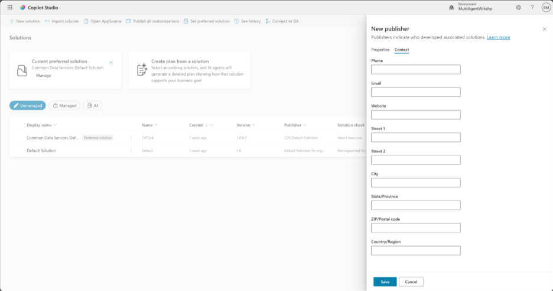

9. Selecciona la pestaña **Properties** y selecciona **Save** para crear el publisher.

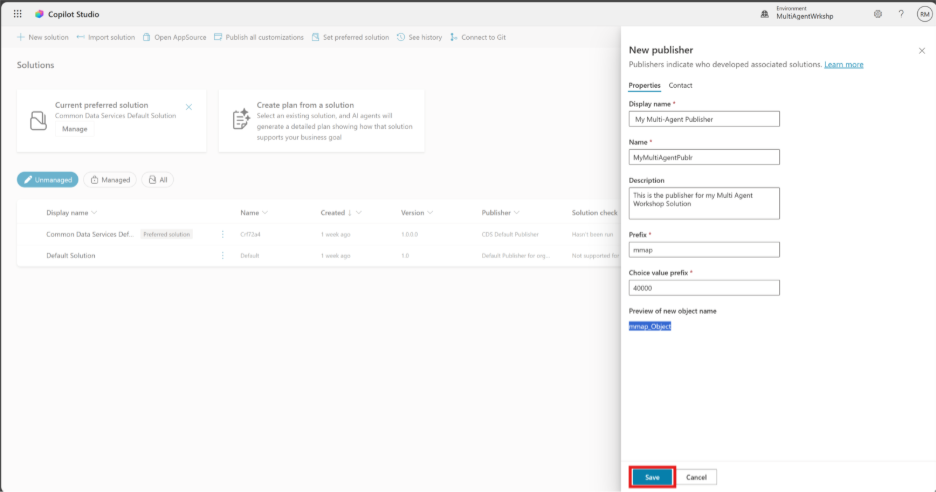

9. El panel New publisher se cerrará y volverás al panel **New solution** con el publisher recién creado seleccionado.
    
Bien hecho, ¡ya creaste un Solution Publisher! 🙌🏼 

# A continuación aprenderemos a crear una nueva solución personalizada.
Ahora que tenemos el nuevo Solution Publisher
Podemos completar el resto del formulario en el panel **New solution** .. 

1. Copia y pega lo siguiente: 
- Como **Display name: My Multi Agent Solution** 
- Como **Name**: **MyMultiAgentSln** 
- Como estamos creando una solución nueva, el número de **Version** de forma predeterminada será 1.0.0.0. 
- Marca la casilla **Set as your preferred solution** . 
- Despliega **More options** para ver detalles adicionales que se pueden proporcionar en una solución. 

Verás lo siguiente: 
- **Installed on** - la fecha en la que se instaló la solución. 
- **Configuration page** - los desarrolladores configuran un recurso web HTML para ayudar a los usuarios a interactuar con su aplicación, agente o herramienta; aparecerá como una página web en la sección Information con instrucciones o botones. Se usa sobre todo en empresas o por desarrolladores que crean y comparten soluciones con otras personas. 
- **Description** - describe la solución o una descripción de alto nivel de la configuration page. 

2. Los dejaremos en blanco para este laboratorio.
 

3. Selecciona **Create**. 

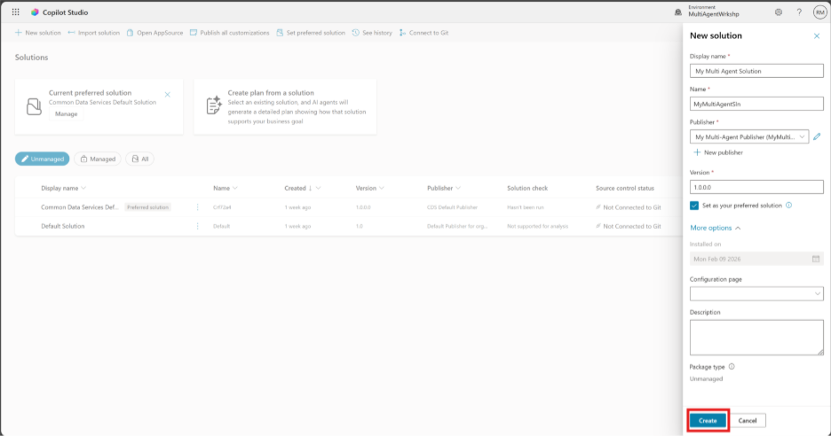

4. La solución **My Multi Agent Solution** ya se creó. No habrá componentes hasta que creemos un agente en Copilot Studio. 

5. Selecciona el ícono de flecha hacia atrás para volver al Solution Explorer.
   

6. Haz que tu solución sea la solución predeterminada / Confírmalo
7. Verifica que tu solución “” tenga la etiqueta “Preferred Solution” al lado. 

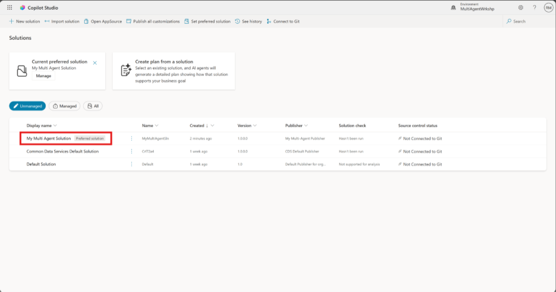

8. Si no es así, selecciona los puntos suspensivos “…” junto a tu solución y luego selecciona la opción “Set preferred solution” en el menú desplegable, como se muestra a continuación: 

9. En la ventana emergente, haz clic en la lista desplegable y selecciona tu solución “**MyMultiAgentSln**” 

10. Haz clic en “Apply” para confirmar que quieres establecer tu solución “**MyMultiAgentSln**” como la solución preferida. 

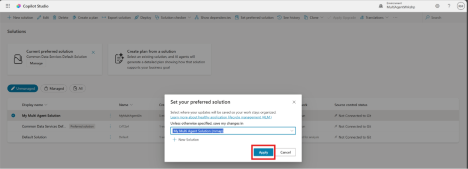

11. Ahora tu solución “**MyMultiAgentSln**” debe tener la etiqueta “Preferred solution” al lado. 

# **🎉**** Misión completada **

✅**Ahora has terminado de configurar tu entorno de laboratorio para Microsoft Copilot Studio.** ¡Felicitaciones!
