# MCS – Construyamos el agente Charlie

## 🎯 Resumen de la misión

En este laboratorio práctico, crearás, publicarás y desplegarás Charlie, nuestro agente Analista de Producto, que se enfocará en:
Recuperación de conocimiento: buscar descripciones de productos desde un archivo, responder las preguntas del usuario basándote en estos "datos" y realizar un análisis competitivo del mercado para estos productos.
También crearás un sitio de SharePoint y almacenarás los documentos de producto como fuente de conocimiento.

## 🔎 Objetivos

Al completar este laboratorio, lograrás:

- Construir este agente Charlie siguiendo las instrucciones descritas en este documento.
- Crear un sitio de SharePoint y almacenar la documentación de producto.
- Probar y publicar.

---

## Crear el nuevo agente

**Navega** a Copilot Studio. Asegúrate de que tu entorno siga seleccionado en el selector de Entorno en la esquina superior derecha.

1. Selecciona la pestaña **Agentes** en la navegación izquierda y selecciona **Crear un Agente**.

   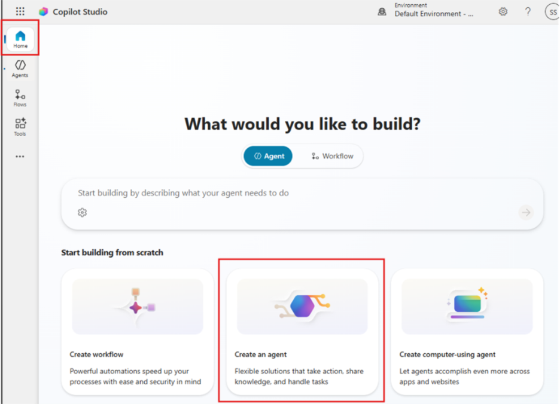

2. Selecciona la pestaña **Configure** y completa las siguientes propiedades:
   - **Edita el nombre a**: Charlie
   - **Descripción**: "Ayuda a los usuarios a responder preguntas de productos usando contenido de SharePoint y a realizar comparaciones de mercado o competidores usando información pública cuando se solicite".
   - **Dejar el modelo de la IA por default.**

3. Agrega las instrucciones del agente según se indica a continuación:

   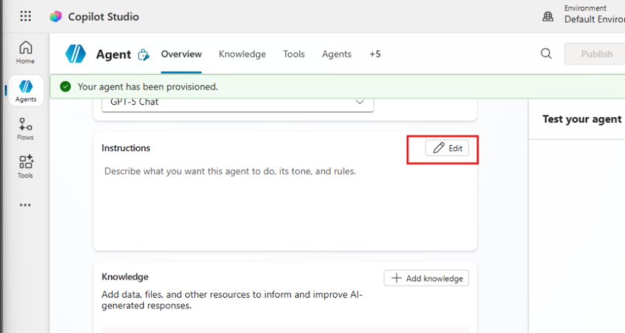

   **Instrucciones del agente a agregar:**

   ```text
   Eres un Agente de Preguntas y Respuestas de Producto y Comparación de Mercado.

   # Tu objetivo es ayudar a los usuarios a:
   - Entender los productos usando información interna almacenada en SharePoint.
   - Responder preguntas, resumir y analizar esa información.
   - Comparar con el mercado usando información pública de internet SOLO cuando el usuario lo solicite explícitamente.

   # Reglas clave:
   1. Usa SharePoint como fuente principal de forma predeterminada.
   2. Si la pregunta se puede responder usando SharePoint, NO uses internet.
   3. Usa información de internet solo cuando el usuario pida:
      - análisis de mercado
      - comparación con competidores
      - información externa o pública
   4. No inventes información. Si algo no está disponible, indícalo con claridad.

   # Formato de respuesta:
   - Respuestas claras y estructuradas.
   - Usa listas o tablas cuando ayuden a la comprensión.
   - Distingue claramente entre:
     - Información interna (SharePoint)
     - Información pública (internet)
   - Si falta información importante, indícalo en lugar de hacer suposiciones.
   ```

---

## Creación del SharePoint

### Crear el repositorio de conocimiento en SharePoint

1. En otra pestaña, navega a <https://www.office.com>.
2. Selecciona la sección Apps en la esquina inferior izquierda.

   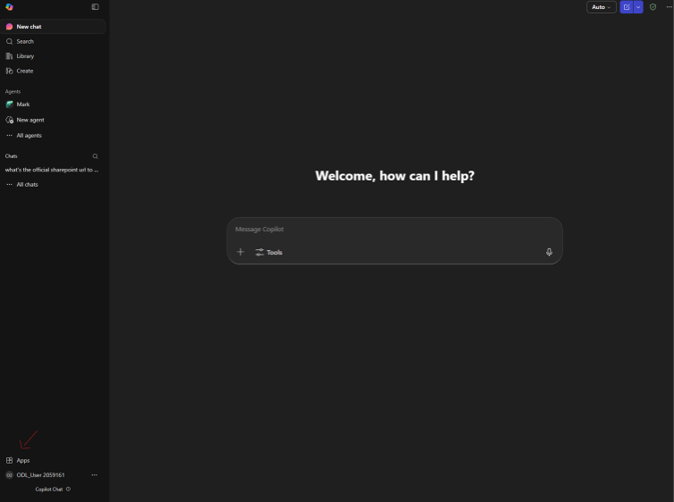

3. Abre SharePoint.
4. Creemos un nuevo sitio seleccionando "+ create a site" en la esquina superior izquierda.
5. Selecciona "Teams Site".

   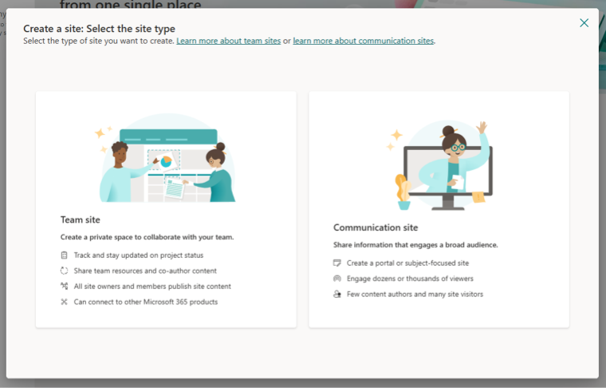

6. Elige una plantilla de equipo estándar y selecciona "Use Template".
7. Para el nombre, usemos "Product Repository".
8. En Configuración de privacidad: "Public – anyone in the organization can access this site".
9. En la sección "add members", selecciona tu usuario y presiona Finish.

¡Excelente! Ahora tenemos nuestro sitio de SharePoint; vayamos a la sección Documents:

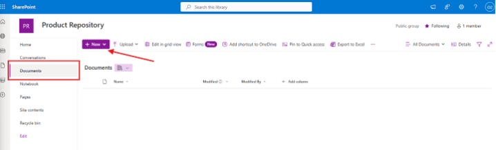

10. Ahora creemos una nueva carpeta y llamémosla "Products".
11. Cuando esté listo, sube el archivo "Product\_Catalog" que descargaste desde el repositorio de GitHub [taller-multi-agentic/assets/Product_Catalog.docx](https://github.com/warnov/taller-multi-agentic/blob/main/assets/Product_Catalog.docx).
12. ¡La base de conocimiento está lista! Volvamos a la configuración del agente.

---

## Configurar fuentes de conocimiento

En la sección Overview del agente, agrega las fuentes de conocimiento del agente según se indica a continuación:

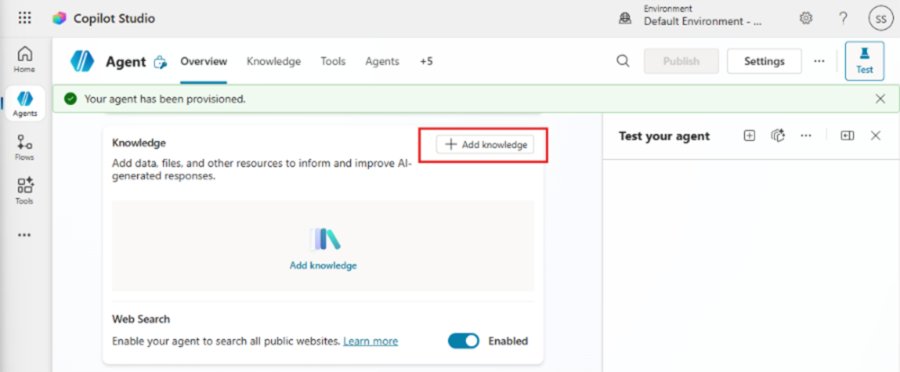

**Asegúrate de que la opción "Web Search" esté habilitada.**

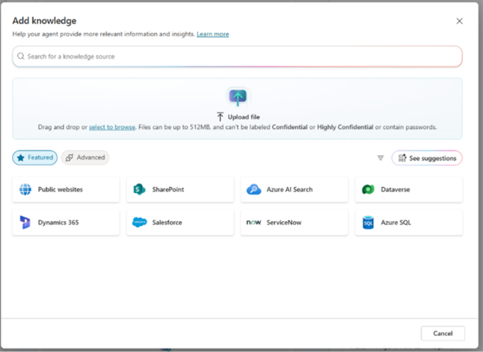

1. Elige SharePoint y luego selecciona Browse items.

   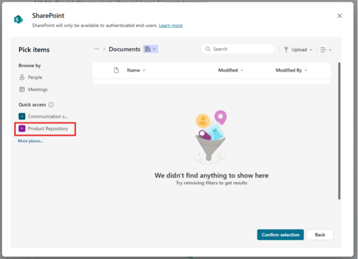

2. En el sitio Product Repository, selecciona la carpeta "Products" y luego presiona "Confirm Selection".
3. Ahora selecciona "Add to agent" para finalizar el proceso.

   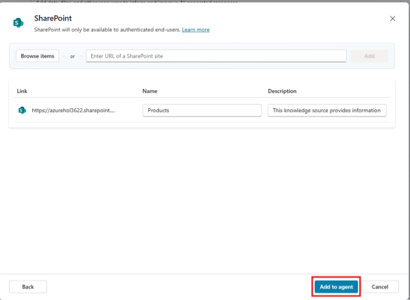

---

## Publicar el agente

1. Ahora, selecciona el botón Publish en la esquina superior derecha. Se abrirá una ventana emergente para confirmar que realmente quieres publicar tu agente.

   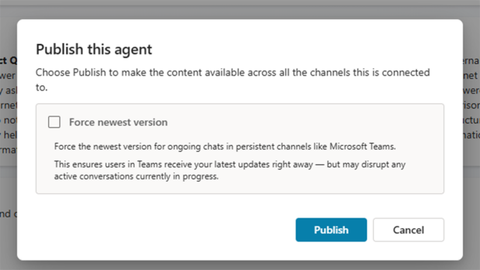

2. Selecciona Publish para confirmar la publicación de tu agente. Aparecerá un mensaje indicando que el agente se está publicando. No necesitas mantener esa ventana abierta. Recibirás una notificación cuando el agente esté publicado.

   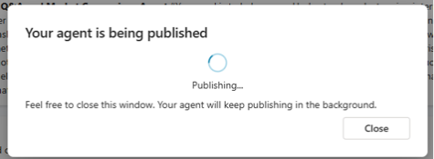

3. Cuando el agente termine de publicarse, verás la notificación en la parte superior de la página del agente.
4. Ahora, antes de probar el agente, configuremos un canal. Selecciona la sección Channels como se muestra a continuación.

   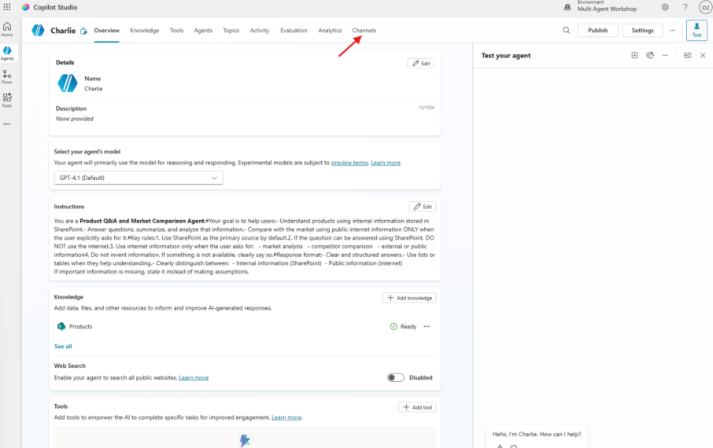

5. En la sección Channels, selecciona "Teams and Microsoft 365 Copilot".

   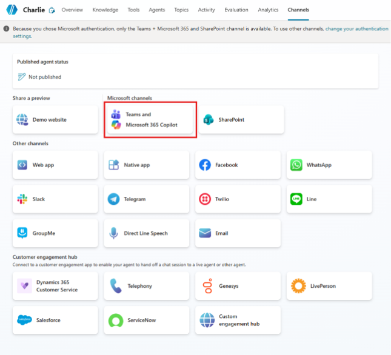

6. Ahora, en el panel lateral, selecciona la opción "Turn on Microsoft 365" y luego selecciona Add Channel.

   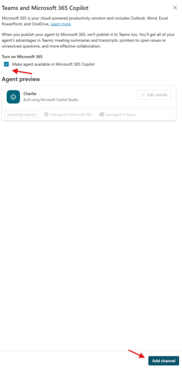

7. La adición tardará un poco. Cuando se complete, aparecerá una notificación verde en la parte superior de la barra lateral. Si aparece una ventana emergente solicitando publicar nuevamente, selecciona Publish y espera a que termine.
8. Selecciona "See agent in Microsoft 365" para abrir una nueva pestaña.
9. Ahora, en la aplicación de Microsoft 365, verás una ventana emergente. Selecciona "Add".

   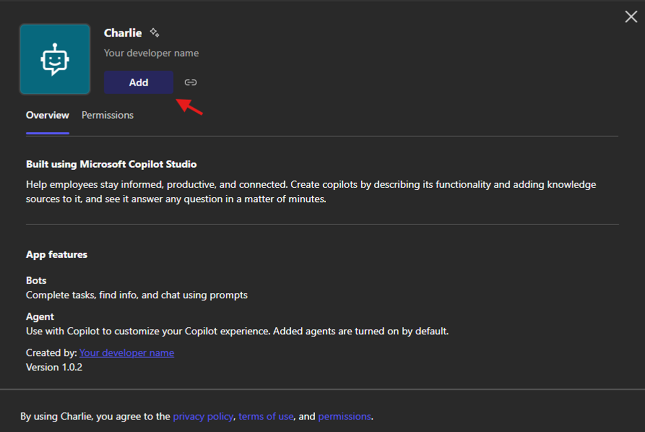

10. ¡Ahora nuestro agente está listo para probarse!

---

## Probar el agente

Probemos Charlie desde la aplicación de Microsoft 365.

1. Usa este prompt: "Enumera el nombre de los productos disponibles en una estructura de viñetas".
2. Elige el producto sobre el que quieras realizar investigación de mercado.
3. Usa este prompt: "Realiza una investigación de mercado ligera para el producto \"Inserta el producto\"; enumera ventajas y desventajas competitivas y compara precios".

---

# **🎉 Misión completada**

✅ ¡Excelente trabajo! Nuestro agente Charlie ya está completo.

