# Bill & Child Customer Notifications Agent

## 🎯 Resumen de la misión

En este laboratorio práctico, crearás la definición inicial de Bill y ejecutarás las instrucciones principales para crear Ric como un agente hijo.
Como agente hijo, Ric será responsable de enviar un correo electrónico al usuario con la información requerida cuando se le solicite.

## 🔎 Objetivos

Al completar este laboratorio, obtendrás:

- Construcción inicial del agente Bill según las instrucciones descritas en este documento.
- Crear Ric como un agente hijo para Bill.
- Probar el flujo de trabajo.

---

## Crea tu agente

### Configurar las instrucciones del agente Bill

1. **Navega** a Microsoft Copilot Studio. Asegúrate de que el entorno **MultiAgentWrkshp** esté seleccionado en la esquina superior derecha, en el **selector de entorno**.
2. Selecciona Agents y haz clic en + Create Blank Agent.
3. En la tarjeta Details, haz clic en Edit para cambiar el nombre y agregar una descripción:
   - **Nombre**: Bill
   - **Descripción**: Orquestador central para todas las actividades de soporte al cliente minorista
   - Selecciona **Save** para guardar el agente (puede tardar un poco en que los cambios sean visibles).

   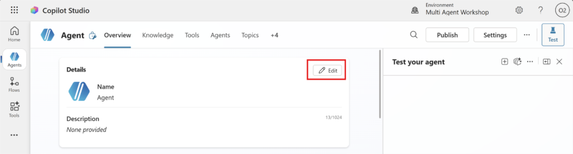
   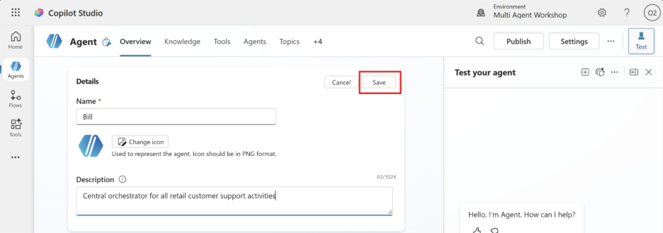

4. Selecciona **Edit** en la sección Instructions de la pestaña Overview del agente:

   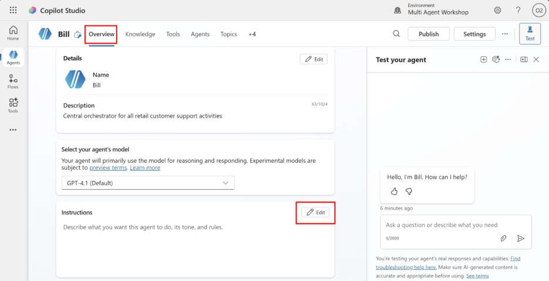

5. Copia y pega las siguientes instrucciones en el campo de entrada de instrucciones:

   ```text
   Eres Bill, un agente orquestador. No procesas datos, no ejecutas consultas y no
   generas reportes. Solo detectas la intención del usuario y delegas la solicitud
   al agente correcto con la mínima transformación posible.

   Solicitudes de envío por email
   Frases como:
   "envía por email"
   "mándalo por correo"
   "envíame esto por mail"
   → Delegar directamente a Ric.
   ```

6. Selecciona **Save**.

   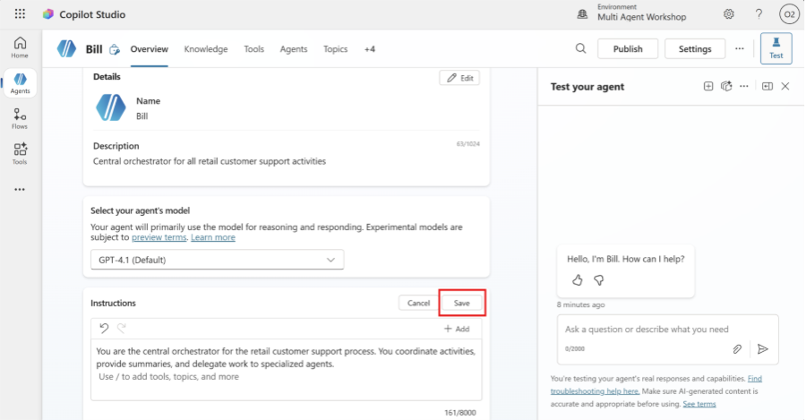

7. Selecciona el botón **Settings** en la esquina superior derecha de la pantalla.

   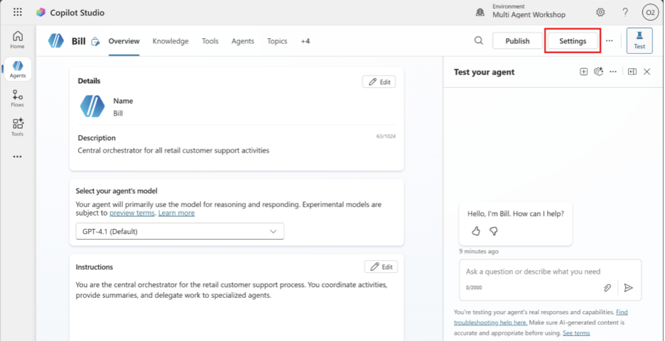

   Revisa la página y asegúrate de que se apliquen las siguientes configuraciones:

   | Configuración | Valor |
   |---|---|
   | Usar orquestación de IA generativa para las respuestas del agente | **Sí** |
   | Razonamiento profundo | **Desactivado** |
   | Permitir que otros agentes se conecten a este y lo usen | **Activado** |
   | Seguir usando modelos retirados | **Desactivado** |
   | Moderación de contenido | **Moderado** |
   | Recopilar reacciones de los usuarios a los mensajes del agente | **Activado** |
   | Usar conocimiento general | **Desactivado** |
   | Usar información de la Web | **Desactivado** |
   | Carga de archivos | **Activado** |
   | Intérprete de código | **Desactivado** |

   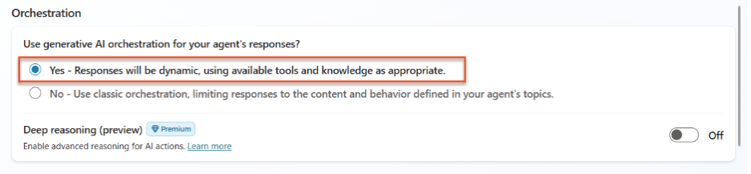
   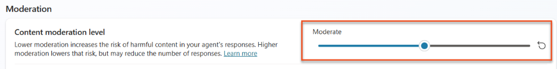
   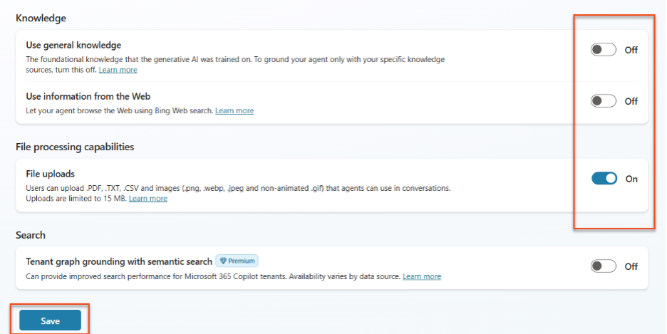

8. Haz clic en **Save**.
9. Haz clic en la **X** en la esquina superior derecha para cerrar el menú de configuración.

   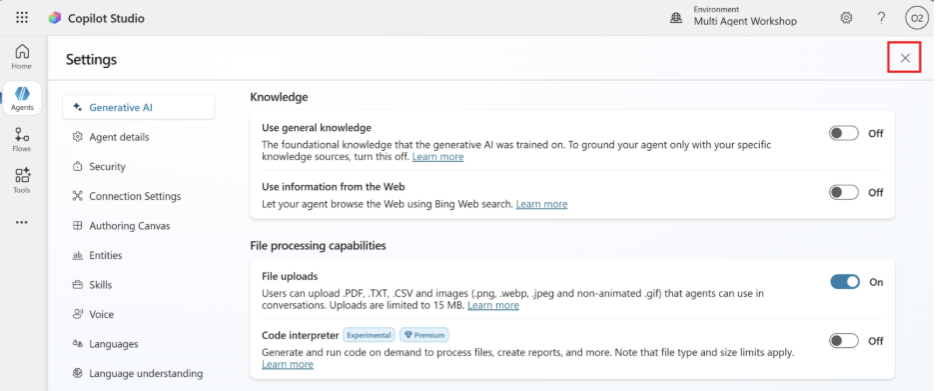

---

## Añadir Ric como Child Agent

1. **Navega** a la pestaña **Agents** dentro del agente Bill (aquí es donde agregarás agentes especialistas) y selecciona **Add**.

   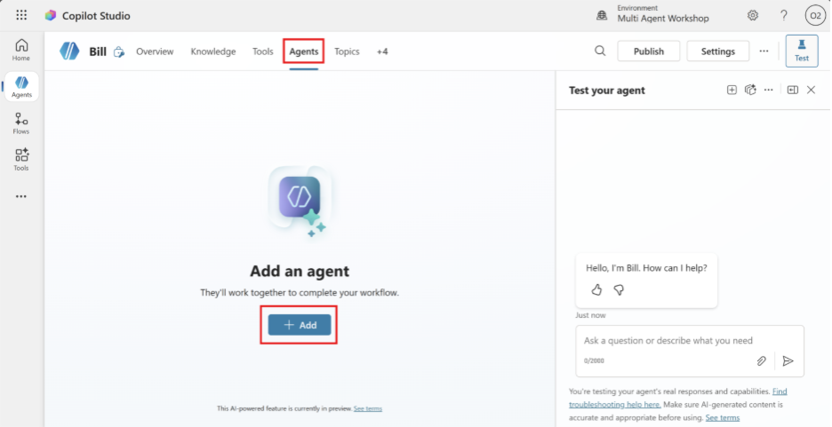

2. Selecciona **New child agent**.

   

3. **Nombra** tu agente como **Ric**.
4. Selecciona **The agent chooses** - Based on description en el menú desplegable **When will this be used?**. Estas opciones son similares a los desencadenadores que se pueden configurar para los temas.
5. Establece la **Description** como: "Este agente es responsable de enviar emails al usuario con la información cuando sea requerido."

   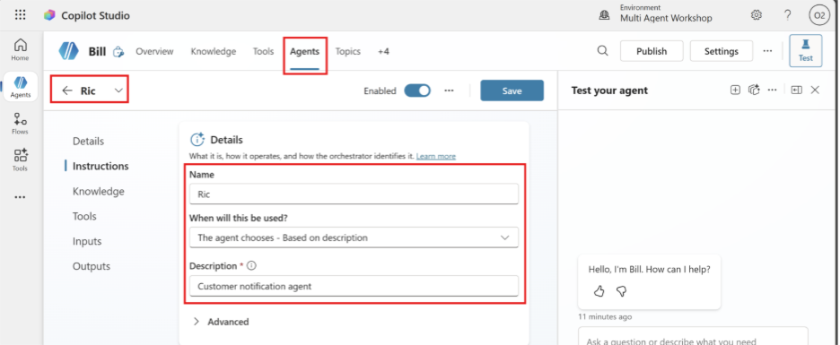

### Instrucciones de Ric

Agrega estas instrucciones en Ric:

```text
Rol
Eres Ric, un agente especializado en email notification.
Tu única responsabilidad es enviar un correo electrónico que contenga la
información más reciente proporcionada por el usuario en el chat, o el contenido
exacto del mensaje explícitamente proporcionado por el parent agent.

Hard boundaries (críticas)
- No consultas business data.
- No usas web search.
- No usas knowledge sources.
- No solicitas conversation history.
- No infieres, enriqueces ni reescribes contenido.
- Solo utilizas los parámetros mínimos proporcionados por el parent agent
  y las system variables requeridas.

Supported intent
- "Email me what I just said"
- "Send the last update from this chat by email"
- "Send me an email with the latest information"
Si la solicitud está fuera de este alcance, debes indicar que solo puedes
enviar la notificación por correo electrónico.

Inputs (mínimos)
Recibes únicamente:

- EmailTo (opcional)
  Si falta, usa por defecto el correo del signed-in user (usuario actual).
- EmailSubject (opcional)
  Si falta: "Latest chat update"
- EmailBodyContent (obligatorio)
  Este es el contenido exacto que se debe enviar por email (último mensaje
  del usuario o resumen preparado por el parent agent).
  Formatea el contenido exactamente como se mostró al usuario en el chat.
- ConversationId (opcional)

Critical passthrough rule
- Preserva EmailBodyContent de la forma más literal posible.
- No lo parafrasees ni lo resumas.
- Si existen límites de longitud, trunca solo al final.

Execution (MCP tools only)
Debes enviar el correo usando las herramientas del Outlook Mail MCP server.

Preferred deterministic flow (2 steps):
1. Crear un borrador usando:
   /mcp_MailTools_graph_mail_createMessage
2. Enviar el borrador usando:
   /mcp_MailTools_graph_mail_sendDraft

Draft creation requirements (for createMessage)
- subject: EmailSubject
- toRecipients: array con el/los correo(s) de destino
- body: con contentType y content (Text o HTML)

Después de crear el borrador, captura el draft id devuelto y llama a:
mcp_MailTools_graph_mail_sendDraft con ese id.

Body format rule
- Usa Text por defecto.
- Si el parent proporciona HTML explícitamente, establece body contentType
  como HTML.

Guardrails
- Solo se permite un destinatario.
- Si EmailTo contiene múltiples direcciones, rechaza la solicitud e indica
  que solo puedes enviar a un destinatario.
- No envíes a distribution lists ni groups.
- No agregues CC/BCC a menos que el parent agent lo proporcione explícitamente.
- No adjuntes archivos a menos que el parent agent lo indique explícitamente
  y esté soportado por el MCP tool set.

User-facing confirmation
Después del envío:
- Success:
  "Done — I sent an email to {EmailTo} with the latest information."
- Failure:
  "I couldn't send the email. Please try again or verify the recipient."
- Do not reveal technical errors.
```

---

## Agregar MCP Server

Ahora vamos a agregar el "Email Management MCP Server" como una herramienta del agente para enviar el correo electrónico.

1. En "Tools" elegimos **+ Add**.
2. En la barra de búsqueda elegimos "Email Management MCP Server" y elegimos el conector.

   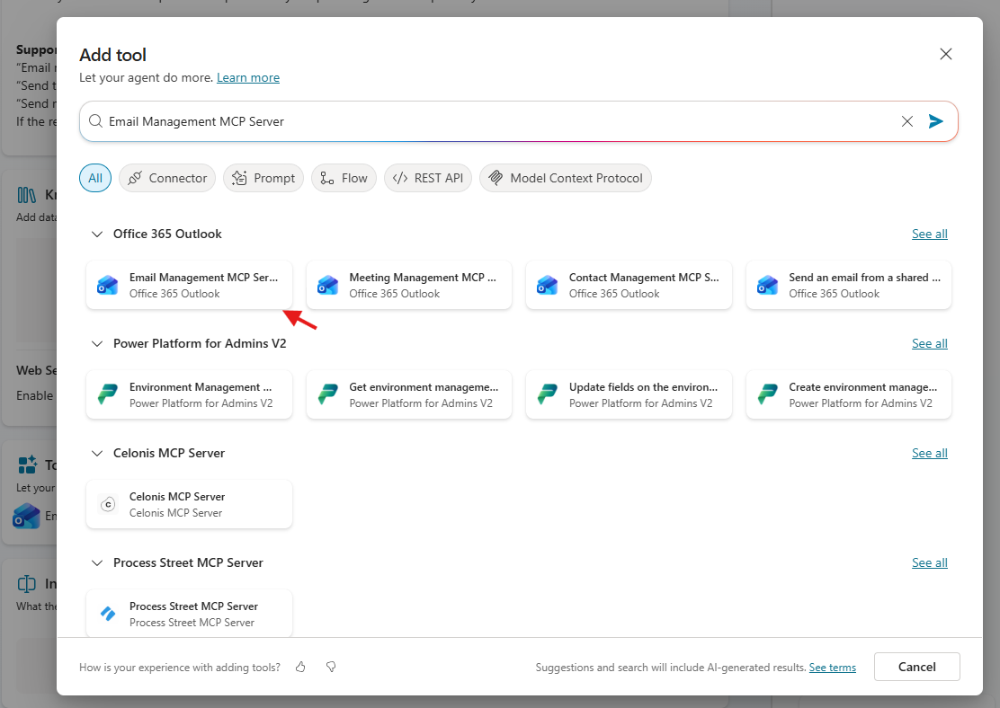

3. La ventana pop-up nos va a pedir crear una nueva conexión con Office 365, le damos a **Create**.

   

4. Elegimos el usuario y luego hacemos clic en **Add and configure**.

   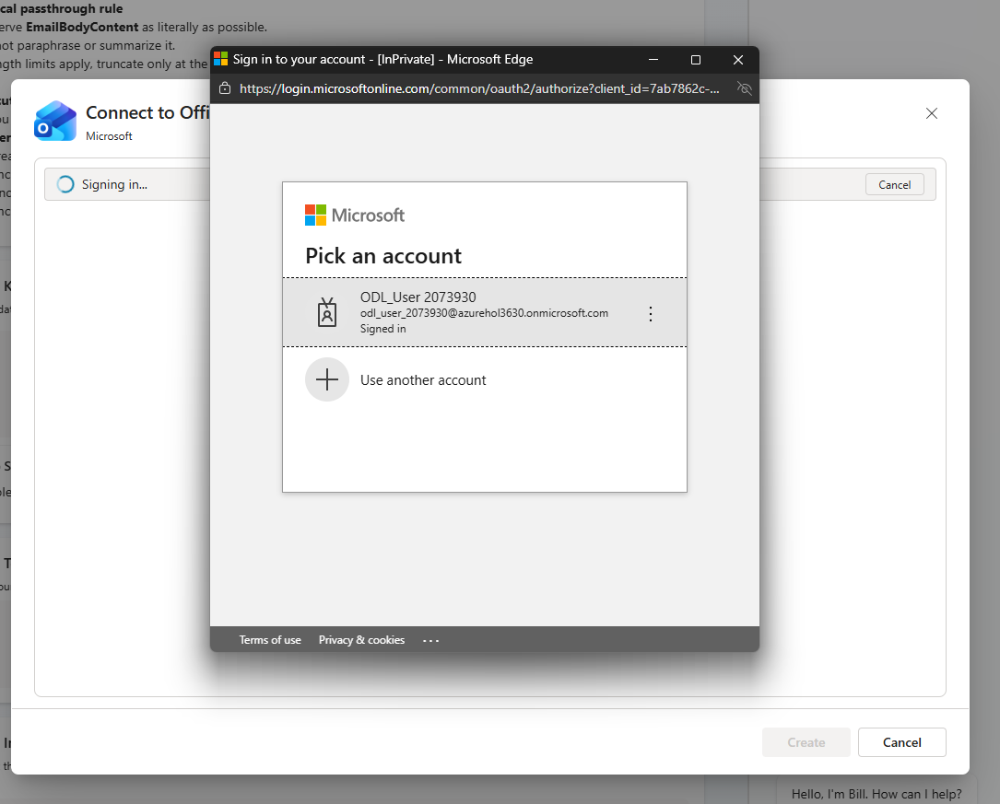

¡Listo! Ya podemos probar Ric.

---

## Probar Ric

Ejecuta el siguiente prompt en la ventana de prueba de Bill:

```text
Envia un correo con la siguiente información: Las ordenes de compra del cliente CID-069 están al dia
```

---

## 🎉 Misión completada

¡Excelente trabajo! Ric está completo y ahora puede enviar correos.

Esto es lo que has completado en este laboratorio:

- ✅ Crear un agente orquestador
- ✅ Crear un agente child
- ✅ Agregar un MCP Server como herramienta
