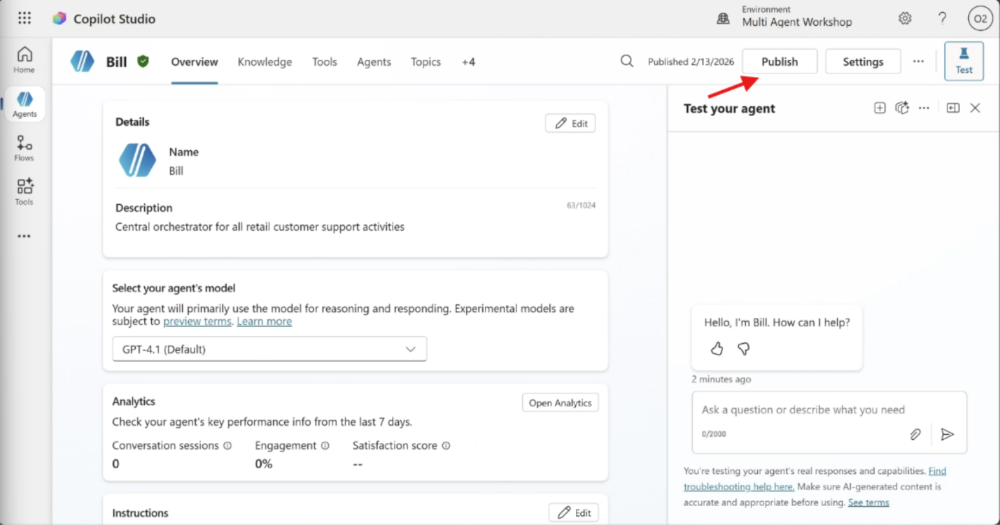
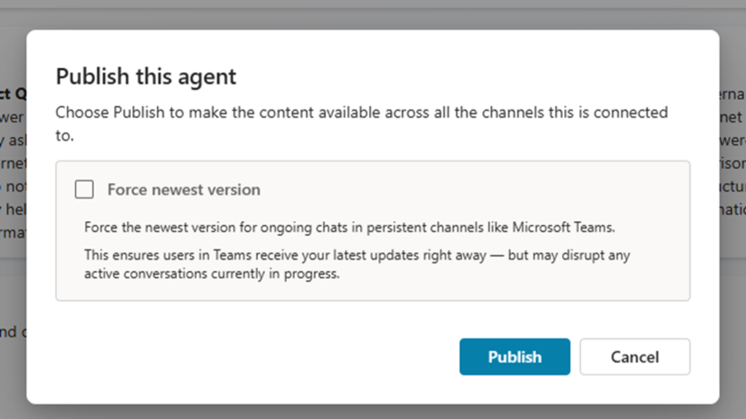
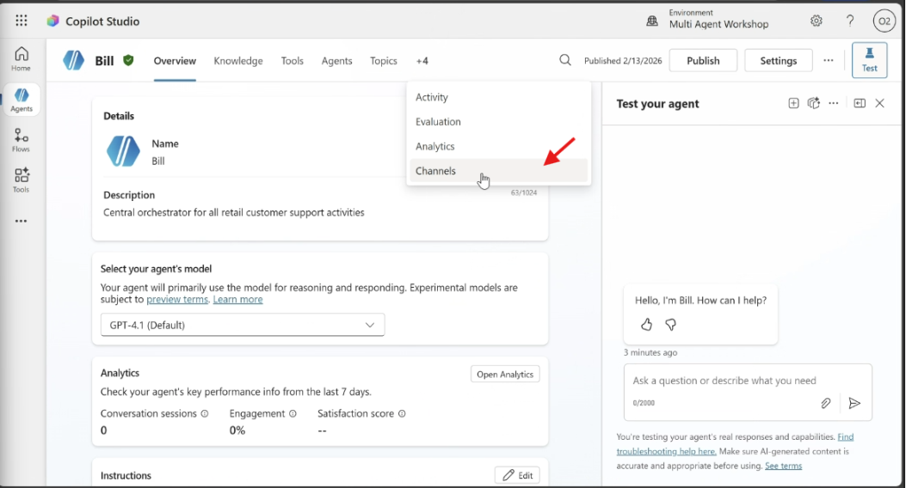
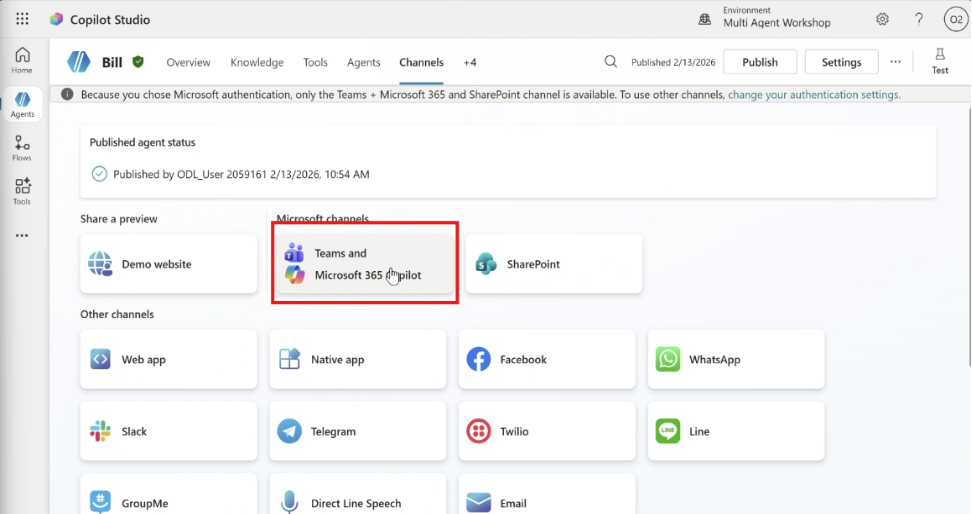
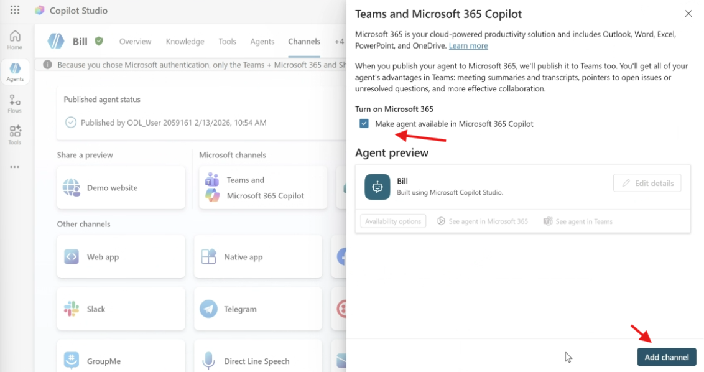
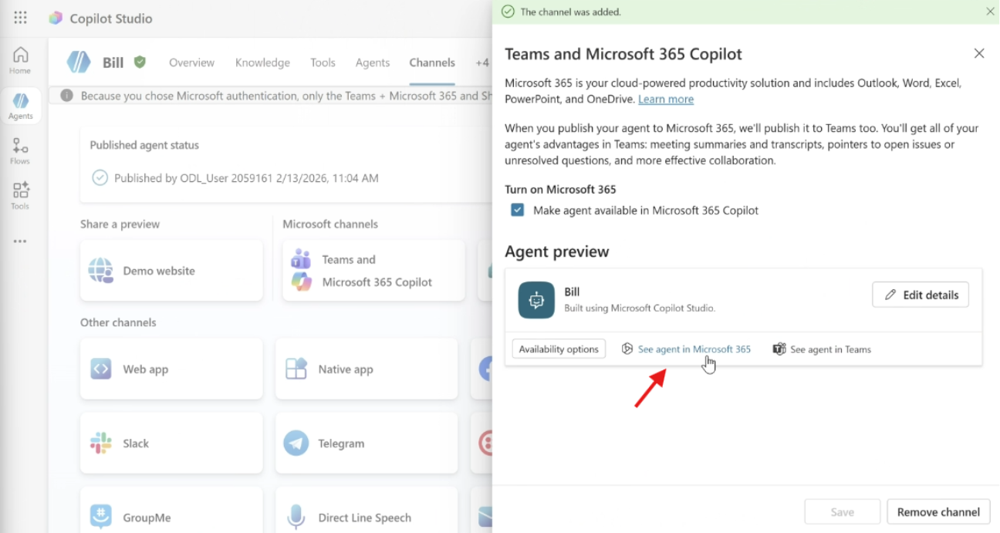
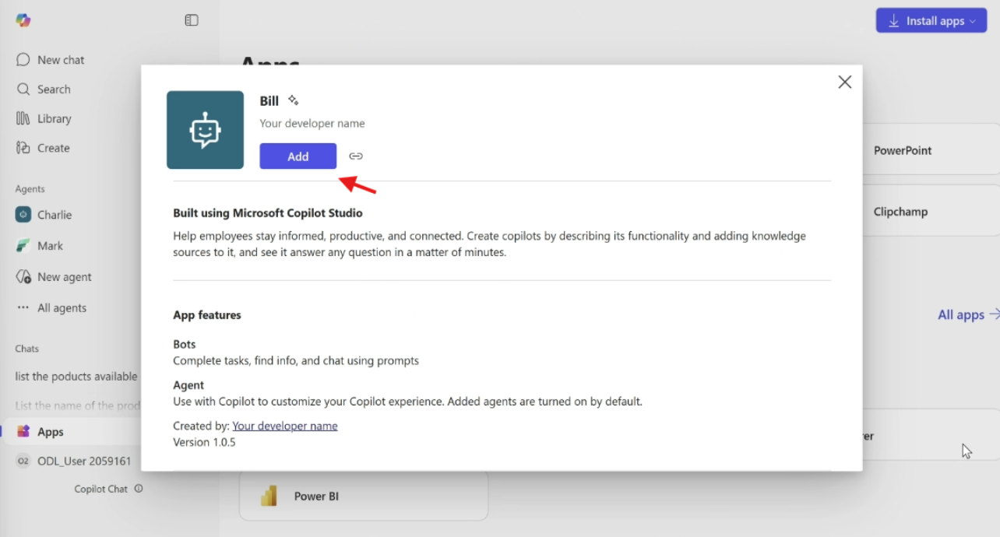
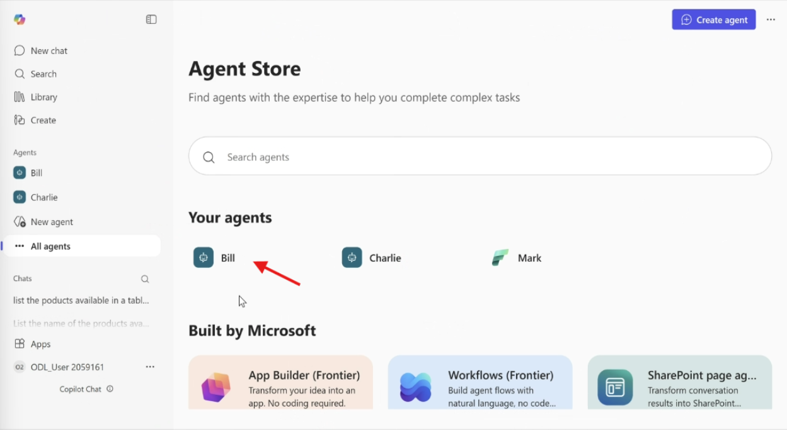

# MCS – Bill: Publicación y Pruebas

## 🎯 Resumen de la misión

En este laboratorio vamos a publicar el agente Bill y realizar pruebas a través de la aplicación de Microsoft 365.

## 🔎 Objetivos

Al completar este laboratorio, ustedes van a aprender:

- Cómo publicar el agente usando el canal de Microsoft 365 y Microsoft Teams.
- Consultar el agente desde Microsoft 365.

---

## Proceso de Publicación

1. Ahora, selecciona el botón **Publicar** en la esquina superior derecha. Se abrirá una ventana emergente para confirmar que realmente quieres publicar tu agente.

   
   

2. Selecciona **Publicar** para confirmar la publicación de tu agente. Aparecerá un mensaje indicando que tu agente se está publicando. No es necesario que mantengas abierta esa ventana emergente. Recibirás una notificación cuando el agente se haya publicado.

   

3. Cuando el agente termine de publicarse, verás la notificación en la parte superior de la página del agente.
4. Ahora, antes de probar el agente, configuremos un canal. Selecciona la sección **Canales** como se muestra a continuación.

   

5. En la sección **Canales**, selecciona "Teams y Microsoft 365 Copilot".

   

6. Ahora, en el panel lateral, selecciona la opción "Activar Microsoft 365" y luego selecciona **Agregar canal**.

   

7. Tomará un poco de tiempo hasta que se agregue. Cuando se haya agregado, aparecerá una notificación verde en la parte superior de la barra lateral. Si aparece un mensaje emergente solicitando publicar nuevamente, selecciona **Publicar** y espera a que finalice.
8. Selecciona "Ver agente en Microsoft 365" para abrir una nueva pestaña.

   

9. Ahora, en la aplicación de Microsoft 365, verás una ventana emergente. Selecciona "Agregar".

   

10. ¡Ahora nuestro agente está listo para ser probado!

---

## Probar Bill

Probemos Bill desde la aplicación de Microsoft 365.

1. Selecciona Bill de tus agentes.

   

2. **Prompt de prueba — Escenario 1:**

   ```text
   Genera un reporte con las ordenes de compra del cliente CID-069, incluye fecha de inicio y fin de la orden, el producto, marca, categoria, cantidad, precio, nombre del cliente y numeros de orden.
   ```

3. **Prompt de prueba — Escenario 2:**

   ```text
   Muestra el detalle del producto Coffee maker
   ```

   Cuando el agente haya respondido, ingresa el siguiente prompt:

   ```text
   Envíame un mail con esa información
   ```

4. Ahora en otra pestaña, abre <https://outlook.office.com> y en la bandeja de entrada encontrarás el mail con la información.

---

## 🎉 Misión completada

¡Excelente trabajo! Nuestro agente Bill ya está completo.

✅ ¡Felicitaciones! Has publicado tu agente con éxito, lo implementaste en un sitio web de demostración y lo probaste antes de implementarlo para los usuarios finales en el sitio web de la empresa minorista.
