# Microsoft Fabric - Setup del Ambiente

## 🎯 Mission Brief

En este laboratorio aprenderás a construir la base de tu plataforma de datos utilizando **Microsoft Fabric**. A lo largo de esta guía crearás
la capacidad de Fabric que funcionará como entorno central para alojar la base de datos y administrar la información de manera organizada y
escalable.

Posteriormente, desarrollarás el **modelo semántico**, habilitando que los datos puedan ser consumidos de forma eficiente por diferentes
experiencias analíticas y de inteligencia artificial.

Siguiendo las instrucciones paso a paso, obtendrás experiencia práctica en la preparación de datos y en la creación de una base sólida que
permitirá su integración con soluciones como Copilot y agentes de IA.

------------------------------------------------------------------------

## 🔎 Objetivos

Al completar este laboratorio lograrás:

-   Crear la capacidad de Microsoft Fabric **"wsfbcagentic"**.\
-   Crear el workspace **"wsfcagentic"**.\
-   Crear la base de datos SQL **"db_retail"** y cargar los datos.\
-   Crear un **Modelo Semántico** sobre los datos cargados en la base de
    datos **"db_retail"**.

------------------------------------------------------------------------

# Desarrollo del Laboratorio

------------------------------------------------------------------------

# 1. Crear la capacidad de Microsoft Fabric

## 1.1 Iniciar sesión

1.  Inicia sesión en el portal de **Microsoft Azure**.\
2.  Busca el servicio **Microsoft Fabric** y selecciónalo.

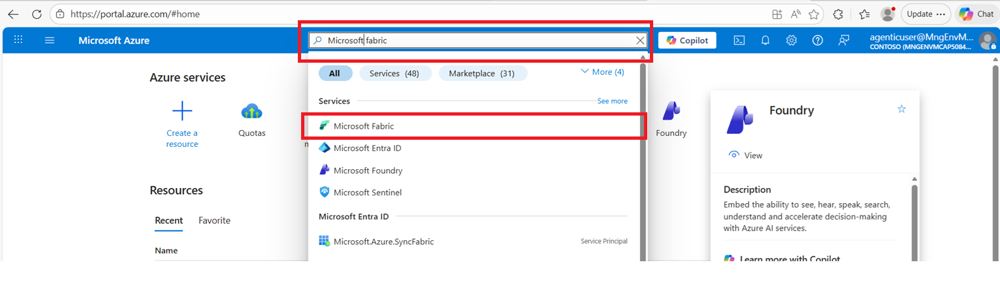

## 1.2 Crear nueva capacidad

1.  Haz clic en **Crear una nueva capacidad de Microsoft Fabric**.

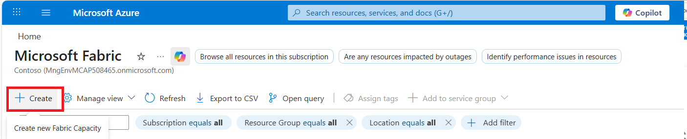

2.  Crea un grupo de recursos para la capacidad de Microsoft Fabric.

## 1.3 Configurar la capacidad

Establece la configuración que se va a crear:

-   Definir nombre.\
-   Seleccionar región.\
-   Seleccionar el tamaño de la capacidad.\
-   Revisar la configuración.

3.  Una vez validada exitosamente la configuración, procede a crear la
    capacidad.

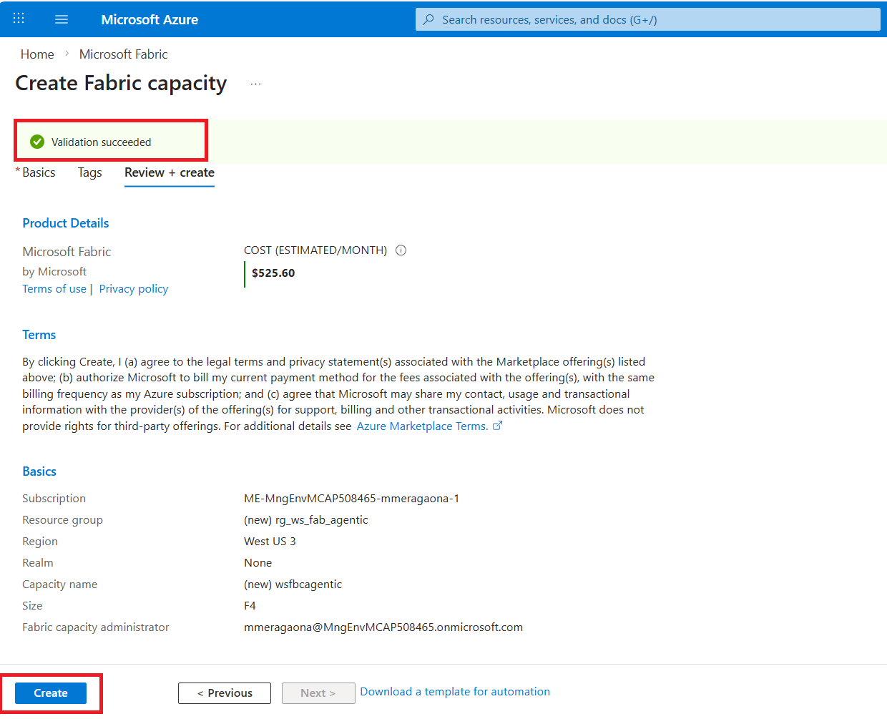

4.  Cuando finalice la creación, podrás ir al recurso.

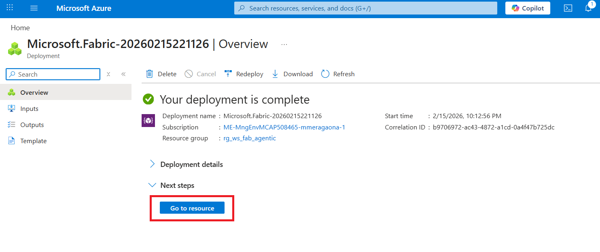

## 1.4 Explorar el recurso desplegado

En los detalles del recurso en Microsoft Azure podrás:

-   Iniciar o pausar la capacidad.\
-   Cambiar el tamaño de la capacidad (aumentar o disminuir).\
-   Nombrar nuevos administradores de la capacidad.

------------------------------------------------------------------------

# 2. Crear el Workspace "wsfcagentic"

## 2.1 Crear el Workspace

1.  Inicia sesión en **Microsoft Fabric**.\
2.  Ve al tab **Workspaces** y selecciona **Nuevo Workspace**.

3.  Especifica la configuración del workspace.

4.  Define el tipo de workspace.

5.  Selecciona la capacidad de Fabric que utilizará el workspace.\
    \> Solo aparecerán las capacidades que se encuentren encendidas.

6.  Finaliza la configuración indicando que la capacidad usará el
    formato de almacenamiento por defecto y aplica los cambios para
    crear el workspace.

Para mayor información, consulta la documentación oficial.

Una vez creado el workspace, verás un área de trabajo similar a la
siguiente imagen:

------------------------------------------------------------------------

# 3. Crear Base de Datos y Cargar Datos

## 3.1 Crear la base de datos

1.  Selecciona la opción para crear un nuevo item.

2.  Filtra por **SQL database** y selecciona la opción correspondiente.

3.  Asigna el nombre **db_retail** a la base de datos y procede a
    crearla.

Una vez creada la base de datos, se abrirá automáticamente un nuevo tab
que te permitirá acceder rápidamente a ella. Además, podrás navegar por
los elementos como tablas, vistas, procedimientos almacenados y
funciones a través del explorador de objetos.

------------------------------------------------------------------------

## 3.2 Cargar los datos

1.  Abre una pestaña para ejecutar scripts SQL seleccionando la opción
    **New Query**.\
    Se abrirá un área de trabajo para ejecutar código SQL.

2.  Copia el código SQL contenido en el archivo **Create database.sql**
    y ejecútalo haciendo clic en **Run**.

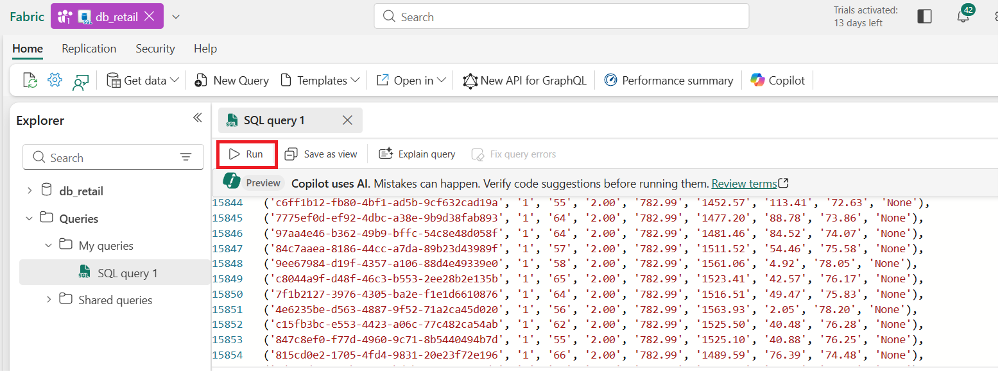

3.  Una vez ejecutado el script, recibirás una notificación indicando
    que el código fue ejecutado correctamente.

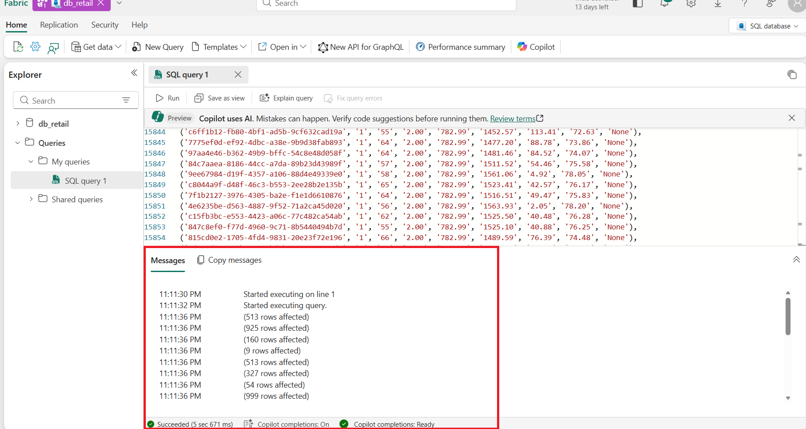

4.  En la pestaña **SQL Query 1**, reemplaza el código anterior por el
    contenido del archivo **Update Dates.sql** y ejecútalo.

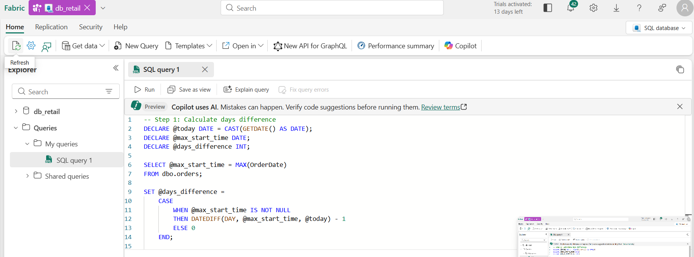

5.  Como resultado, se mostrará que varias filas fueron afectadas.\
    Este script realiza ajustes sobre las fechas de los datos en la base
    de datos.

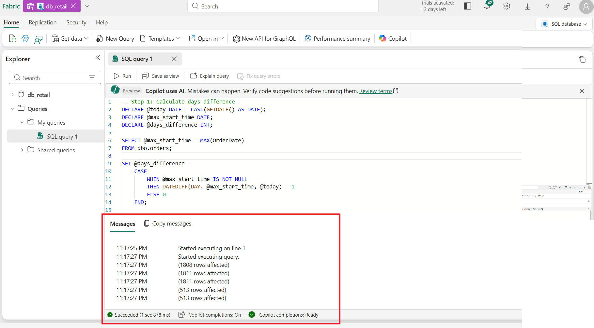

------------------------------------------------------------------------

# 4. Crear Modelo Semántico (Opcional)

En **Microsoft Fabric**, un **modelo semántico** es la capa de negocio
que da significado a los datos técnicos y los hace fáciles de analizar,
reutilizar y gobernar. Traduce la complejidad técnica en un lenguaje de
negocio mediante métricas, nombres amigables y relaciones, sin que los
usuarios necesiten conocer SQL ni la estructura física de las tablas.

Además, un modelo semántico puede utilizarse como fuente de datos para
un **Data Agent**.

------------------------------------------------------------------------

## 4.1 Crear el modelo semántico

1.  Ve al workspace.

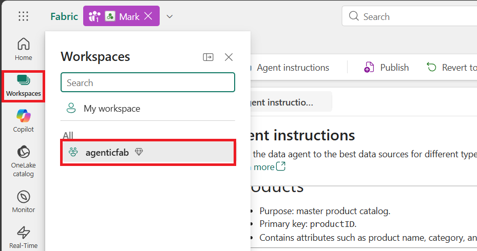

2.  Abre el **SQL Analytics Endpoint** de la base de datos
    **db_retail**.

3.  Crea un nuevo modelo semántico.

4.  Configura el modelo semántico:

-   Nombre: **sm_retail**\
-   Workspace: **agenticfab**\
-   Tablas: `customer`, `orders`, `orderline`, `product`

Confirma la creación.

------------------------------------------------------------------------

## 4.2 Editar el modelo semántico

1.  Ve al workspace, busca el modelo semántico creado y ábrelo.

2.  Cambia la vista a modo edición.

------------------------------------------------------------------------

## 4.3 Crear relaciones

Crea las siguientes relaciones:

1.  **Customer → Orders**
    -   Cardinalidad: 1:\*

\

2.  **Orders → Orderline**
    -   Cardinalidad: 1:\*

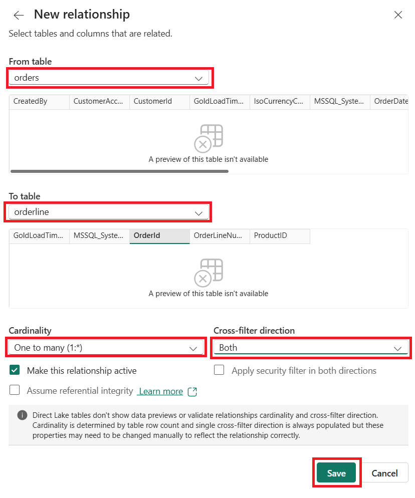

3.  **Orderline → Product**
    -   Cardinalidad: 1:1

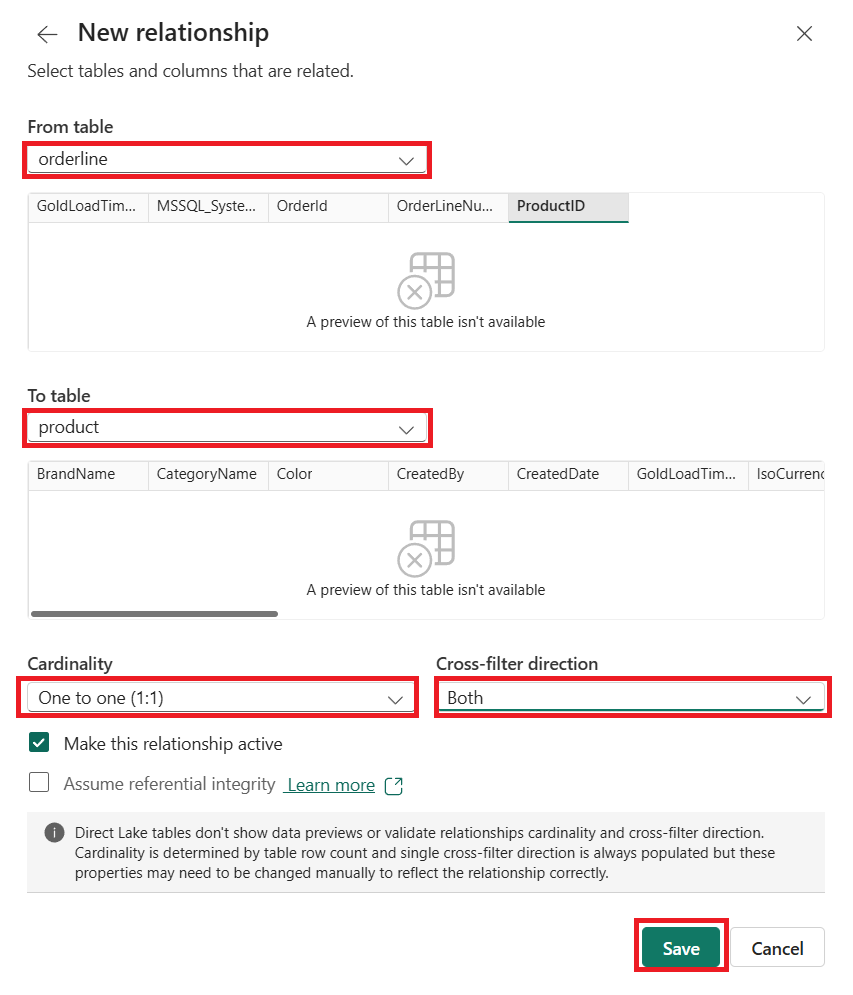

El resultado final deberá verse como el siguiente modelo semántico:

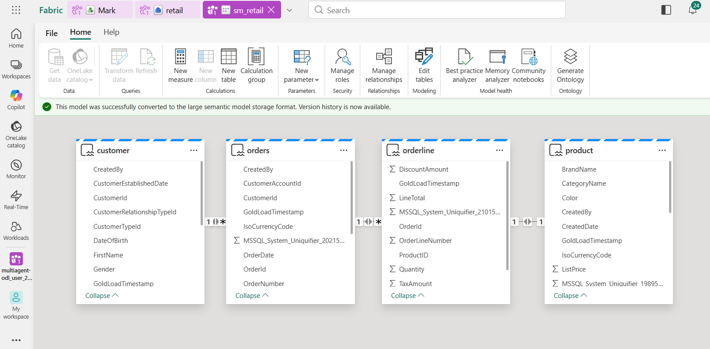

------------------------------------------------------------------------

# 🎉 Mission Complete

Tu plataforma de datos ha sido creada y tus datos están listos para ser
procesados y consumidos por agentes de IA.
