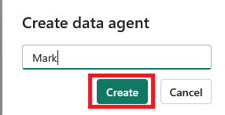
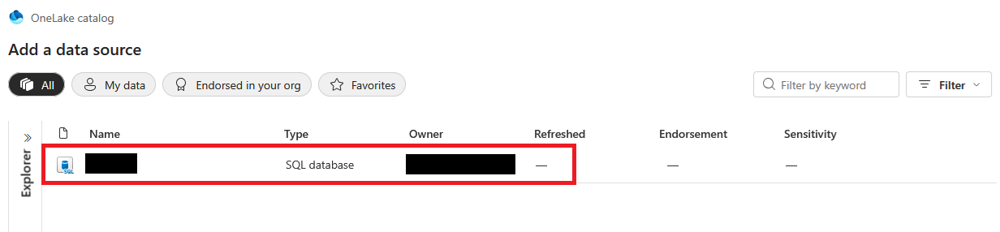
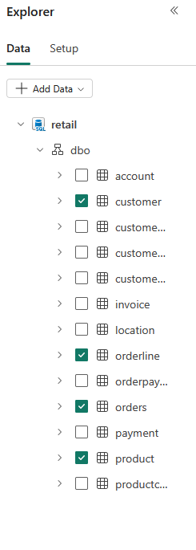
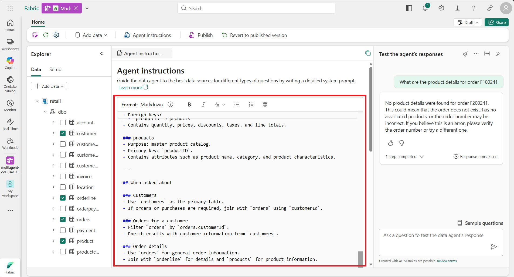
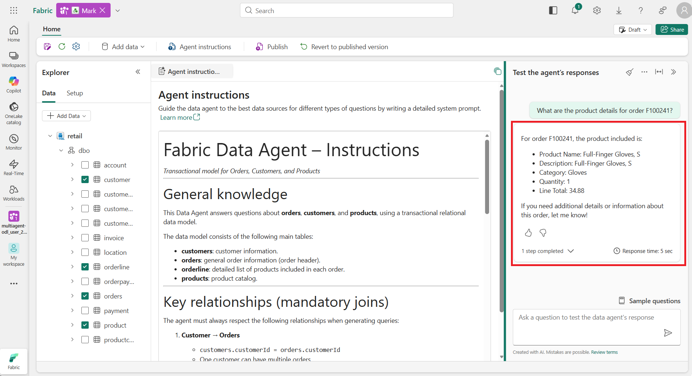
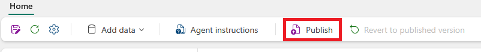
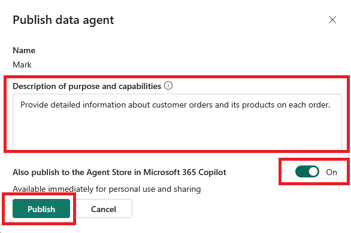
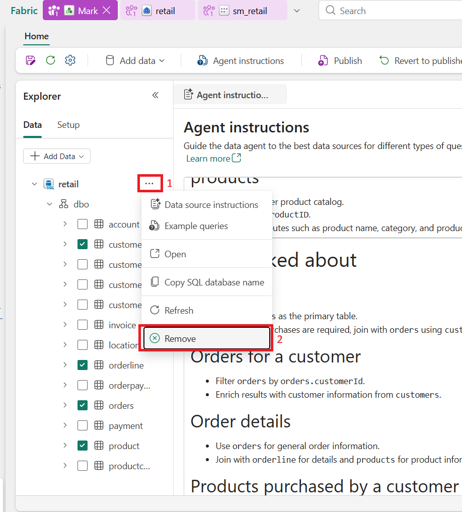
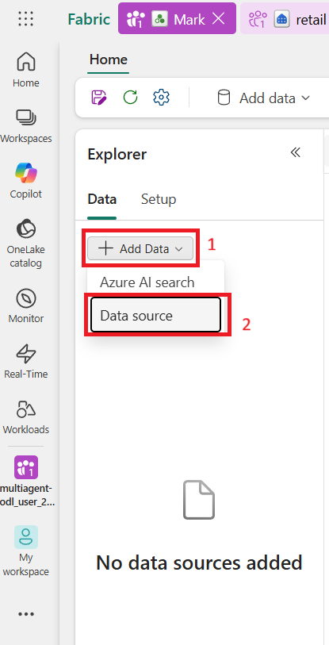
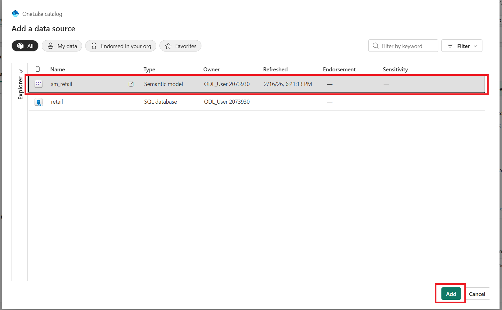

# Lab 02: Mark Facts Agent


# MF - Mark

Microsoft Fabric - Creación y configuración de agente de datos llamado Mark

## 🎯 Mission Brief

En este laboratorio aprenderás a construir un agente de datos que reconoce e interpreta lenguaje natural utilizando Microsoft Fabric. A lo largo de la guía, crearás un agente de datos en Microsoft Fabric que podrá responder, vía lenguaje natural, preguntas sobre el modelo de datos de órdenes de ventas que preparaste en el paso anterior. Siguiendo las instrucciones paso a paso, obtendrás experiencia práctica en la preparación de este agente de datos para su posterior utilización por Copilot Studio.

## 🔎 Objetivos

Al completar este laboratorio lograrás:

1. Crear el agente de datos llamado "Mark".
2. Revisión y prueba de las respuestas a preguntas.
3. Publicación del agente de datos.
4. Usar el modelo Semántico como Fuente de datos del Data Agent

En la siguiente sección, se presentan los pasos del laboratorio:

---

## 1. Crear el agente de datos llamado "Mark".

### a. Seleccionar la opción para crear un nuevo item


### b. Buscar "Agent"

### c. Seleccionar el "Data Agent (preview)"


### d. Darle el nombre de "Mark" y seleccionar "Create"




### e. Agregar "Data Source"


### f. Seleccionar la "SQL database" creada en el laborario anterior.



### g. Seleccionar solo las siguientes tablas:

i. customer  
ii. orderline  
iii. orders  
iv. product  



---

## 2. Revisión y prueba de las respuestas a preguntas.

### a. En la sección de "Test the agent's response", prueba las siguientes preguntas en la interfaz disponible para el agente


i. what are the orders from Omar Bennett? / ¿Cuáles son las órdenes de Omar Bennett?  
ii. what are the orders from Omar Bennett and the detailed products for each order? / ¿Cuáles son las órdenes de Omar Bennett y el detalle de productos de cada orden?  
iii. What are the order from customer CID-069 from June 2019 to May 2021? / ¿Cuáles son las órdenes para el cliente CID-069 entre julio del 2019 a mayo del 2021?  
iv. What are the historical trends across all my data? / ¿Cuáles son las tendencias históricas en todos mis datos?

v. What are the product details for order F100241? ¿ Cuáles son los detalles de los productos de la orden F100241?


Si al tratar de recuperar los productos no obtienes respuesta, realizar el paso b

---

### b. Ajustar el comportamiento del Agente en la sección de "Agent Instructions".

La sección Agent Instructions define el meta-prompt del Data Agent: establece cómo debe razonar, qué contexto de negocio usar y cómo responder. No ejecuta consultas, pero guía todo el razonamiento, ayudando a producir respuestas más precisas, con prioridad correcta de fuentes, mejor interpretación de la intención del usuario y un formato/estilo esperado.

Para más información sobre Agent Instructions puedes consultar [Data agent configurations](https://learn.microsoft.com/en-us/fabric/data-science/data-agent-configurations#data-agent-instructions).


---

### i. Agregar las siguientes instrucciones en la sección de "Agent Instructions"

```markdown 
Fabric Data Agent - Instructions

Transactional model for Orders, Customers, and Products

This Data Agent answers questions about orders, customers, and products.

The data model consists of the following main tables:

- customers: customer information.
- orders: general order information (order header).
- orderline: detailed list of products included in each order.
- products: product catalog.

Key relationships (mandatory joins)

The agent must always respect the following relationships when generating queries:

1. Customer - Orders
   customers.customerId = orders.customerId
   One customer can have multiple orders.

2. Orders - Order details
   orders.orderId = orderline.orderId
   One order can contain multiple product lines.

3. Order details - Products
   orderline.productID = products.productID
   Each order line references a product from the catalog.

When a query involves customers, orders, and products, the agent must traverse these relationships.

Reasoning principles

- Questions about customers must start from the customers table.
- Questions about orders must use orders as the main table.
- Questions about order details must join orders with orderline and products.
- Questions about products purchased or what a customer bought must use orderline.
- If a question is ambiguous, the agent should ask for clarification.

Table descriptions

customers
- Purpose: stores customer information.
- Primary key: customerId.
- Contains descriptive customer attributes.

orders
- Purpose: represents the order header.
- Primary key: orderId.
- Foreign key: customerId.
- Contains general information such as order date, status, and order total.

orderline
- Purpose: stores detailed product information per order.
- Foreign keys:
  orderId -> orders
  productID -> products
- Contains quantity, prices, discounts, taxes, and line totals.

products
- Purpose: master product catalog.
- Primary key: productID.
- Contains attributes such as product name, category, and product characteristics.

When asked about

Customers
- Use customers as the primary table.
- If orders or purchases are required, join with orders using customerId.

Orders for a customer
- Filter orders by orders.customerId.
- Enrich results with customer information from customers.

Order details
- Use orders for general order information.
- Join with orderline for details and products for product information.

Products purchased by a customer
- Use orderline as the central table.
- Join with orders to filter by customer.
- Join with products to retrieve product details.
---
```


iii. Al finalizar la configuración del comportamiento del agente se tendrá la sección de "Agent Instructions" de esta manera



iv. Probar nuevamente el agente con las instrucciones agregadas:
1. limpiar el chat
2. confirmar que se quiere limpiar el chat


v. Probar nuevamente el agente con la pregunta que no se pudo resolver: What are the product details for order F100241?



---
## 3. Publicación del agente de datos.

### a. Seleccionar "Publish" en el menu de opciones del agente



### b. Agregar una descripción que detalle el obejtivo esperado cuando sea utilizado en Copilot Studio

### c. Seleccionar la opción para que se publique en "Agent Store in Microsoft 365 Copilot"



---

## 4. Usar el modelo Semántico como Fuente de datos del Data Agent

### a. Puedes crear un nuevo data Agent o Eliminar la fuente de datos de Mark


i. Eliminar la fuente de datos de Mark



ii. Eliminar la instrucciones de la sección "Agent Instructions"

### b. Agregar la nueva fuente de datos


### c. Seleccionar el modelo semántico



### d. Incluir las tablas Customer, Orders, Orderline, y Product


### e. Revisa el agente y si no responde de la forma esperada, agrega las instrucciones en la sección Agent Instructions.

### f. Si deseas puedes publicar una nueva versión del data agent o dejar la versión construida en el punto anterior

