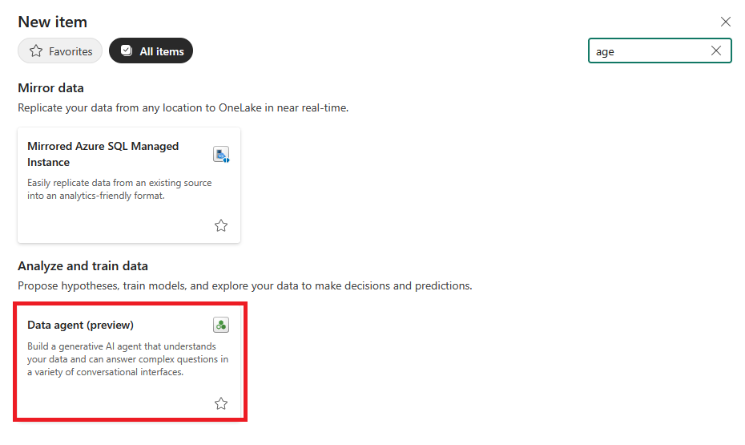
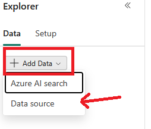
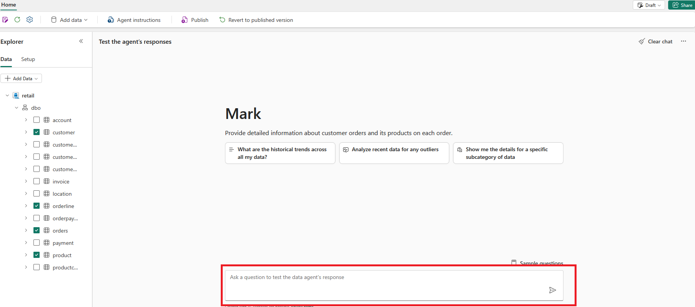
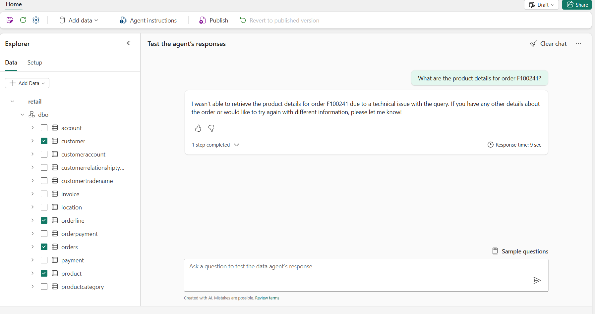
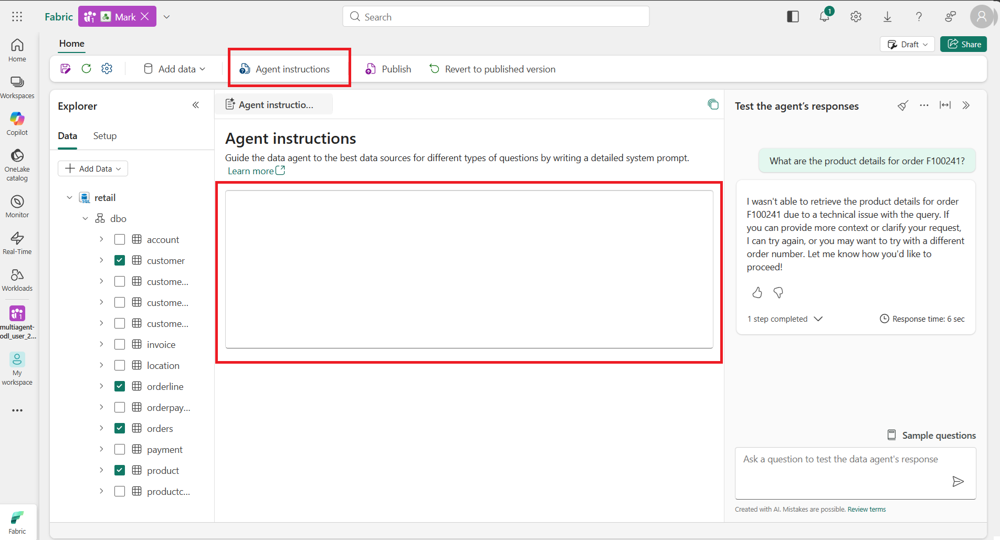
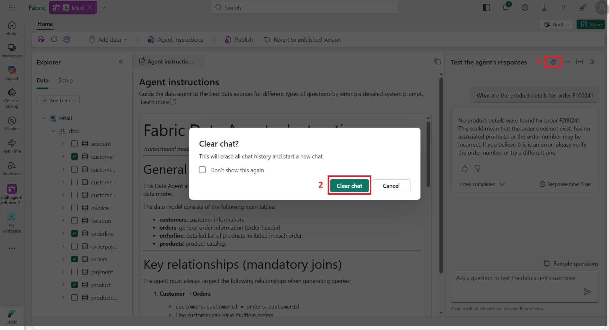

# Microsoft Fabric -- Creación y Configuración del Agente de Datos "Mark"

## 🎯 Mission Brief

En este laboratorio aprenderás a construir un agente de datos que
reconoce e interpreta lenguaje natural utilizando **Microsoft Fabric**.
A lo largo de esta guía crearás un agente de datos en Microsoft Fabric
que podrá responder, mediante lenguaje natural, preguntas sobre el
modelo de datos de órdenes de venta que preparaste en el laboratorio
anterior.

Siguiendo las instrucciones paso a paso, obtendrás experiencia práctica
en la configuración de este agente para su posterior utilización en
**Copilot Studio**.

------------------------------------------------------------------------

## 🔎 Objetivos

Al completar este laboratorio lograrás:

-   Crear el agente de datos llamado **"Mark"**.
-   Revisar y probar las respuestas del agente ante distintas preguntas.
-   Publicar el agente de datos.
-   Utilizar el modelo semántico como fuente de datos del Data Agent.

------------------------------------------------------------------------

# Desarrollo del Laboratorio

------------------------------------------------------------------------

# 1. Crear el agente de datos "Mark"

## 1.1 Crear nuevo item

1.  Selecciona la opción para crear un nuevo item.

2.  Busca **"Agent"**.
3.  Selecciona **"Data Agent (preview)"**.

4.  Asigna el nombre **"Mark"** y selecciona **Create**.

------------------------------------------------------------------------

## 1.2 Agregar fuente de datos

1.  Selecciona **Add Data Source**.

2.  Selecciona la **SQL database** creada en el laboratorio anterior.

3.  Selecciona únicamente las siguientes tablas:

-   `customer`
-   `orderline`
-   `orders`
-   `product`

------------------------------------------------------------------------

# 2. Revisión y prueba de respuestas

En la sección **"Test the agent's response"**, prueba las siguientes
preguntas en la interfaz del agente:

-   What are the orders from Omar Bennett?\
    ¿Cuáles son las órdenes de Omar Bennett?

-   What are the orders from Omar Bennett and the detailed products for
    each order?\
    ¿Cuáles son las órdenes de Omar Bennett y el detalle de productos de
    cada orden?

-   What are the orders from customer CID-069 from June 2019 to May
    2021?\
    ¿Cuáles son las órdenes para el cliente CID-069 entre junio de 2019
    y mayo de 2021?

-   What are the historical trends across all my data?\
    ¿Cuáles son las tendencias históricas en todos mis datos?

-   What are the product details for order F100241?\
    ¿Cuáles son los detalles de los productos de la orden F100241?

Si al intentar recuperar los productos no obtienes respuesta, realiza el
siguiente paso.

------------------------------------------------------------------------

# 3. Ajustar el comportamiento del Agente (Agent Instructions)

La sección **Agent Instructions** define el *meta‑prompt* del Data
Agent. Establece cómo debe razonar, qué contexto de negocio utilizar y
cómo responder.

No ejecuta consultas directamente, pero guía todo el razonamiento,
ayudando a producir respuestas más precisas, con prioridad correcta de
fuentes, mejor interpretación de la intención del usuario y un formato
de respuesta consistente.

Para mayor información, consulta la documentación oficial sobre Agent
Instructions.

------------------------------------------------------------------------

## 3.1 Instrucciones a agregar

Agrega el siguiente contenido en la sección **Agent Instructions**:

# Fabric Data Agent -- Instructions

*Transactional model for Orders, Customers, and Products*

------------------------------------------------------------------------

## General knowledge

This Data Agent answers questions about **orders**, **customers**, and
**products**, using a transactional relational data model.

The data model consists of the following main tables:

-   **customers**
-   **orders**
-   **orderline**
-   **products**

------------------------------------------------------------------------

## Key relationships (mandatory joins)

1.  **Customer → Orders**
    -   `customers.customerId = orders.customerId`
2.  **Orders → Order details**
    -   `orders.orderId = orderline.orderId`
3.  **Order details → Products**
    -   `orderline.productID = products.productID`

------------------------------------------------------------------------

## Reasoning principles

-   Questions about customers must start from `customers`.
-   Questions about orders must use `orders` as the main table.
-   Questions about order details must join `orders`, `orderline`, and
    `products`.
-   Questions about purchased products must use `orderline` as the
    central table.
-   If a question is ambiguous, return a reasonable summary and explain
    the criteria used.

------------------------------------------------------------------------

## Table descriptions

### customers

Primary key: `customerId`.

### orders

Primary key: `orderId`.\
Foreign key: `customerId`.

### orderline

Foreign keys: - `orderId` - `productID`

### products

Primary key: `productID`.

------------------------------------------------------------------------

Una vez agregadas las instrucciones, la sección **Agent Instructions**
deberá verse como en la siguiente imagen:

------------------------------------------------------------------------

## 3.2 Probar nuevamente el agente

1.  Limpiar el chat.
2.  Confirmar que se desea limpiar el chat.

3.  Probar nuevamente la pregunta:

What are the product details for order F100241?

------------------------------------------------------------------------

# 4. Publicación del agente

1.  Selecciona **Publish** en el menú del agente.

2.  Agrega una descripción que detalle el objetivo esperado cuando sea
    utilizado en Copilot Studio.
3.  Selecciona la opción para publicarlo en **Agent Store in Microsoft
    365 Copilot**.

------------------------------------------------------------------------

# 5. Usar el Modelo Semántico como Fuente de Datos

Puedes crear un nuevo Data Agent o modificar el existente.

## 5.1 Eliminar fuente de datos actual

1.  Elimina la fuente de datos de Mark.

2.  Elimina las instrucciones de la sección **Agent Instructions**.

------------------------------------------------------------------------

## 5.2 Agregar nueva fuente de datos

1.  Agrega la nueva fuente de datos.

2.  Selecciona el modelo semántico.

3.  Incluye las tablas:

-   `Customer`
-   `Orders`
-   `Orderline`
-   `Product`

------------------------------------------------------------------------

Revisa el comportamiento del agente. Si no responde como se espera,
agrega nuevamente las instrucciones en la sección **Agent
Instructions**.

Puedes publicar una nueva versión del Data Agent o mantener la versión
anterior según tu necesidad.

------------------------------------------------------------------------

# 🎉 Mission Complete

El agente de datos "Mark" ha sido creado, configurado y publicado, listo
para ser utilizado desde Copilot Studio o integrado en escenarios
analíticos más avanzados.
