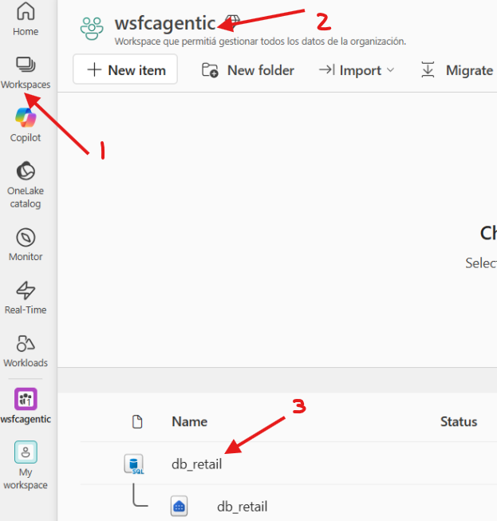
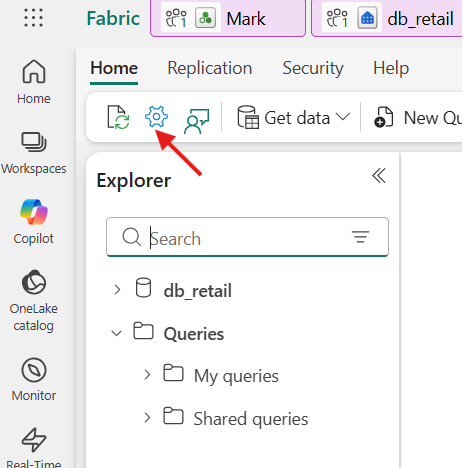
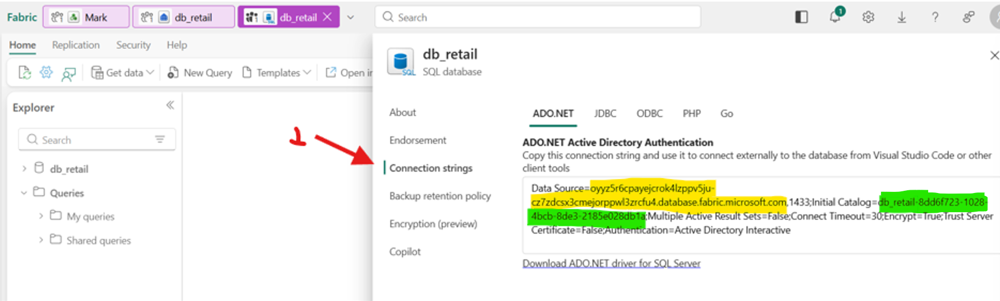

# Como obtener los parámetros de SQL Database para nuestros Agentes?

Si estás siguiendo todos los laboratorios del workshop en orden, estos valores se obtienen del entorno de Fabric desplegado en el [Lab 1](../../fabric/lab01-data-setup.md). De lo contrario, usa el endpoint e identificación de tu base de datos propia.

## Obteniendo los parámetros desde Microsoft Fabric

### Paso 1 — Navega al workspace y abre la base de datos

En el menú lateral de Fabric, haz clic en **Workspaces** y selecciona tu workspace. Localiza el item de tipo **SQL database** (por ejemplo `db_retail`) y ábrelo.



<br clear="left" />

---

### Paso 2 — Abre la configuración de la base de datos

Dentro de la base de datos, haz clic en el icono de **configuración** (engranaje) de la barra de herramientas superior.



<br clear="left" />

---

### Paso 3 — Copia el connection string

En el panel de configuración, selecciona **Connection strings** y busca la cadena **ADO.NET**. De ahí extrae los dos valores que necesitas:

- `FabricWarehouseSqlEndpoint` = valor de **`Data Source`** (marcado en amarillo), **sin** el `,1433` del final
- `FabricWarehouseDatabase` = valor de **`Initial Catalog`** (marcado en verde)

```text
Data Source=xxxxx.database.fabric.microsoft.com,1433;Initial Catalog=retail_sqldatabase_xxx;...
```



<br clear="left" />

---

### Ejemplo de valores resultantes

- `FabricWarehouseSqlEndpoint`:
  - `kqbvkknqlijebcyrtw2rgtsx2e-dvthxhg2tsuurev2kck26gww4q.database.fabric.microsoft.com`

- `FabricWarehouseDatabase`:
  - `retail_sqldatabase_danrdol6ases3c-6d18d61e-43a5-4281-a754-b255fc9a6c9b`

> [!TIP]
> Para la ejecución de este laboratorio solo es necesaria la base de datos de Contoso Retail. Si no estás siguiendo toda la secuencia de laboratorios, no es necesario tener desplegado Microsoft Fabric. Así que para las consultas del Lab 5 (Julie), puedes apuntar directamente a una base SQL standalone (por ejemplo Azure SQL Database) usando:
>
> - `FabricWarehouseSqlEndpoint` = host SQL de tu base standalone
> - `FabricWarehouseDatabase` = nombre de tu base
>
> Si no proporcionas estos valores, el despliegue no falla: omite la configuración de DB para Lab 5 y te mostrará un aviso para configurarla manualmente después.